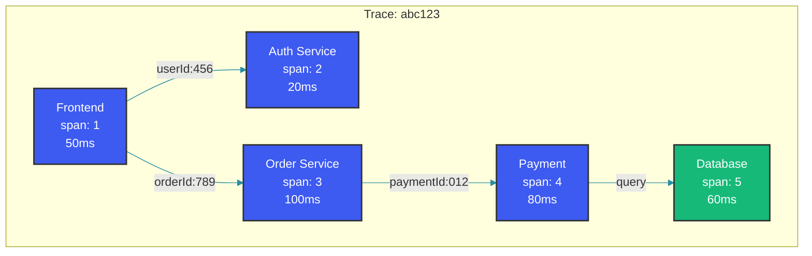

# Distributed Tracing (Jaeger & Zipkin)

## Overview

Distributed tracing tracks requests as they flow through microservices, providing visibility into service dependencies, latency bottlenecks, and error propagation. OpenTelemetry has emerged as the unified standard for instrumentation, with Jaeger and Zipkin as popular backends for trace storage and visualization.

## Problem Statement

In a monolith, a single log or metric tells you what happened. In a distributed system, a single user request creates a cascade of calls across dozens of services. Without tracing, debugging latency spikes or error propagation requires correlating logs across services manually.

## Trace Context Propagation

Every trace has a global trace ID and a span ID per operation. Context propagates across service boundaries via HTTP headers or message metadata.



### Context Propagation with OpenTelemetry

```java
@Service
public class TracingService {
    
    private final Tracer tracer;
    private final OpenTelemetry openTelemetry;
    
    public TracingService() {
        this.openTelemetry = OpenTelemetrySdk.builder()
            .setTraceExporter(
                OtlpGrpcSpanExporter.builder()
                    .setEndpoint("http://jaeger:4317")
                    .build())
            .setResource(Resource.getDefault()
                .toBuilder()
                .put(ResourceAttributes.SERVICE_NAME, "order-service")
                .build())
            .build();
        
        this.tracer = openTelemetry.getTracer("order-service");
    }
    
    public Order processOrder(OrderRequest request) {
        Span span = tracer.spanBuilder("processOrder")
            .setSpanKind(SpanKind.SERVER)
            .setAttribute("order.id", request.getOrderId())
            .setAttribute("user.id", request.getUserId())
            .startSpan();
        
        try (Scope ignored = span.makeCurrent()) {
            // Propagate context to downstream calls
            HttpHeaders headers = new HttpHeaders();
            openTelemetry.getPropagators()
                .getTextMapPropagator()
                .inject(Context.current(), headers, (carrier, key, value) -> 
                    carrier.set(key, value));
            
            // Downstream call with propagated context
            ResponseEntity<PaymentResponse> response = restTemplate.exchange(
                paymentServiceUrl,
                HttpMethod.POST,
                new HttpEntity<>(request, headers),
                PaymentResponse.class
            );
            
            span.setStatus(StatusCode.OK);
            return buildOrder(response.getBody());
            
        } catch (Exception e) {
            span.setStatus(StatusCode.ERROR);
            span.recordException(e);
            throw e;
        } finally {
            span.end();
        }
    }
}
```

## Spring Cloud Sleuth with Brave

```java
@Configuration
public class TracingConfig {
    
    @Bean
    public Sampler defaultSampler() {
        // Always sample for development; use rate-limiting in production
        return Sampler.ALWAYS_SAMPLE;
    }
    
    @Bean
    public Tracing tracing() {
        return Tracing.newBuilder()
            .localServiceName("order-service")
            .spanReporter(ZipkinSpanReporter.builder()
                .endpoint("http://zipkin:9411/api/v2/spans")
                .build())
            .currentTraceContext(ThreadLocalCurrentTraceContext.newBuilder()
                .addScopeDecorator(MDCScopeDecorator.builder().build())
                .build())
            .build();
    }
}

@Service
public class OrderService {
    
    @Autowired
    private Tracer tracer;
    
    @NewSpan(name = "validateOrder")
    public ValidationResult validateOrder(OrderRequest request) {
        // Automatic span creation via @NewSpan annotation
        Span span = tracer.nextSpan().name("validateInventory")
            .tag("productId", request.getProductId())
            .start();
        
        try (SpanInScope scope = tracer.withSpanInScope(span)) {
            return inventoryService.checkAvailability(request);
        } finally {
            span.finish();
        }
    }
}
```

## Span Lifecycle and Sampling

### Custom Span Creation

```java
public class SpanLifecycleDemo {
    
    private final Tracer tracer;
    
    public void processWithCustomSpans() {
        // Create root span
        Span rootSpan = tracer.spanBuilder("processOrder")
            .setAttribute("orderType", "standard")
            .setAttribute("itemCount", 5)
            .startSpan();
        
        try (Scope scope = rootSpan.makeCurrent()) {
            
            // Create child span with explicit parent
            Span childSpan = tracer.spanBuilder("validatePayment")
                .setParent(Context.current().with(rootSpan))
                .setStartTimestamp(System.currentTimeMillis())
                .startSpan();
            
            try {
                validatePayment();
                childSpan.setStatus(StatusCode.OK);
            } catch (Exception e) {
                childSpan.setStatus(StatusCode.ERROR, "Payment validation failed");
                childSpan.recordException(e);
                throw e;
            } finally {
                childSpan.end(); // Record duration
            }
            
            // Annotate specific events within the span
            rootSpan.addEvent("inventory.check.start");
            checkInventory();
            rootSpan.addEvent("inventory.check.complete");
            
        } finally {
            rootSpan.end();
        }
    }
}
```

### Sampling Strategies

```java
@Configuration
public class SamplingConfig {
    
    @Bean
    public Sampler productionSampler() {
        // Head-based consistent probability sampling
        return Sampler.create(0.01); // 1% of all traces
        
        // Or use rate-limiting sampler
        // return RateLimitingSampler.create(10); // 10 traces/second
    }
    
    // Tail-based sampling for error traces (Jaeger)
    @Bean
    public TailSamplingStrategy tailSampler() {
        return new TailSamplingStrategy(
            // Always keep error traces
            new ErrorSampler(),
            
            // Keep traces exceeding latency threshold
            new DurationSampler(100, TimeUnit.MILLISECONDS, 1.0),
            
            // Sample remaining traces at low rate
            new ProbabilisticSampler(0.001)
        );
    }
}
```

## Jaeger vs Zipkin Comparison

| Feature | Jaeger | Zipkin |
|---|---|---|
| Storage Backend | Elasticsearch, Cassandra, Kafka, Badger | Elasticsearch, Cassandra, MySQL, S3 |
| UI Features | DAG view, trace comparison, service graph | Timeline view, dependency graph |
| Sampling | Head + tail-based (adaptive) | Head-based (configurable) |
| Data Model | OpenTracing → OpenTelemetry | Zipkin v1/v2, OpenTelemetry |
| Performance | Lower overhead (sampled) | Lower overhead (sampled) |
| Deployment | All-in-one, production (collector + query) | All-in-one, production (server + storage) |

## OpenTelemetry Integration

```xml
<dependency>
    <groupId>io.opentelemetry</groupId>
    <artifactId>opentelemetry-exporter-otlp</artifactId>
</dependency>
<dependency>
    <groupId>io.opentelemetry</groupId>
    <artifactId>opentelemetry-sdk-extension-autoconfigure</artifactId>
</dependency>
```

```java
@Configuration
public class OpenTelemetryConfig {
    
    @Bean
    public OpenTelemetry openTelemetry() {
        SdkTracerProvider tracerProvider = SdkTracerProvider.builder()
            .addSpanProcessor(BatchSpanProcessor.builder(
                OtlpGrpcSpanExporter.builder()
                    .setEndpoint(System.getenv("OTEL_EXPORTER_OTLP_ENDPOINT"))
                    .setCompression("gzip")
                    .build())
                .setMaxExportBatchSize(512)
                .setExporterTimeout(30, TimeUnit.SECONDS)
                .build())
            .setSampler(Sampler.traceIdRatioBased(0.1))
            .setResource(Resource.getDefault()
                .toBuilder()
                .put(ServiceAttributes.SERVICE_NAME, "order-service")
                .put("deployment.environment", "production")
                .build())
            .build();
        
        return OpenTelemetrySdk.builder()
            .setTracerProvider(tracerProvider)
            .setPropagators(ContextPropagators.create(
                W3CTraceContextPropagator.getInstance()))
            .build();
    }
}
```

## Spring Boot Auto-Instrumentation

```java
@SpringBootApplication
@EnableAutoConfiguration
public class OrderServiceApplication {
    
    public static void main(String[] args) {
        SpringApplication.run(OrderServiceApplication.class, args);
    }
}

// application.yml
opentelemetry:
  traces:
    exporter: otlp
  exporter:
    otlp:
      endpoint: http://jaeger-collector:4317
  propagators: tracecontext, baggage
  resource:
    attributes:
      service.name: order-service
      service.version: 1.2.3
```

## Best Practices

- Propagate trace context through all communication channels (HTTP, gRPC, Kafka, RabbitMQ) using W3C Trace Context headers
- Use consistent sampling rates across all services in a trace; different rates per service create partial traces
- Add business-relevant span attributes (orderId, userId, paymentId) for operational debugging
- Use span events for capturing meaningful points within an operation (cache hit, retry, circuit breaker trip)
- Batch span exports using gRPC with compression to minimize tracing overhead in high-throughput services
- Monitor trace ingestion rate and storage usage to control costs; tail-based sampling helps retain interesting traces
- Set up trace metrics integration: derive RED metrics (Rate, Errors, Duration) from trace data for service dashboards

## Common Mistakes

- Not propagating trace context across async boundaries (thread pools, message queues, scheduled tasks) resulting in broken traces
- Creating too many fine-grained spans per request, increasing storage and overhead beyond value
- Using head-based sampling alone for error traces, missing rare errors because sampling rate was too low
- Forgetting to add OpenTelemetry instrumentation agent or dependencies, resulting in no trace data collected
- Setting sample rate too high in production (e.g. 100%) causing significant overhead and storage costs
- Not filtering health check endpoints from tracing, polluting traces with meaningless polling data

## Summary

Distributed tracing provides end-to-end visibility that metrics and logs alone cannot. OpenTelemetry has unified the instrumentation layer, with Jaeger and Zipkin as mature backends. The key to successful tracing is consistent context propagation across all service boundaries, intelligent sampling to balance observability with cost, and rich span attributes that support operational debugging. Treat traces as a first-class observability signal alongside metrics and logs.

## References

- [OpenTelemetry Documentation](https://opentelemetry.io/docs/)
- [Jaeger Documentation](https://www.jaegertracing.io/docs/)
- [Zipkin Documentation](https://zipkin.io/pages/architecture.html)
- [W3C Trace Context Specification](https://www.w3.org/TR/trace-context/)
- [Spring Cloud Sleuth](https://spring.io/projects/spring-cloud-sleuth)
