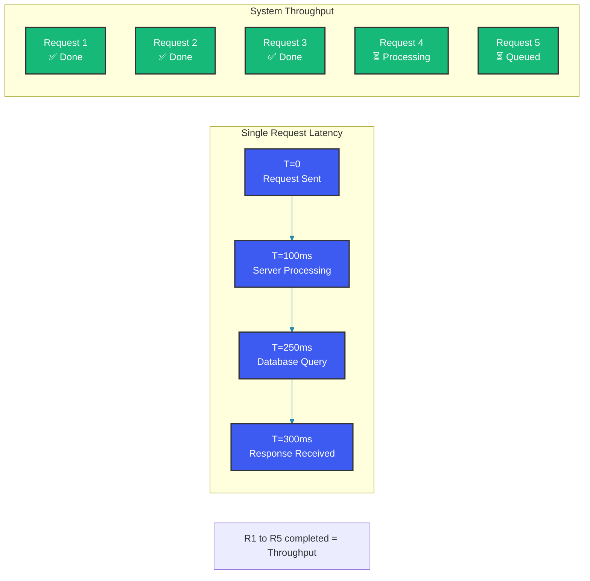
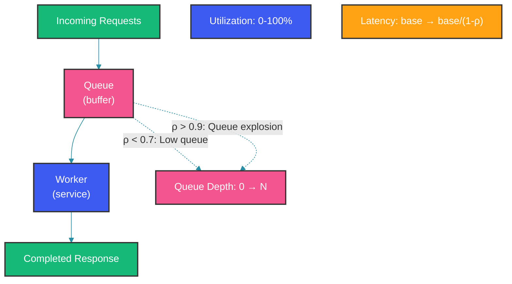

# Latency vs Throughput

## Overview

Latency and throughput are the two fundamental measures of system performance. Latency measures how long a single operation takes, while throughput measures how many operations the system can handle per unit time. Understanding their relationship and the trade-offs between them is essential for designing performant systems.

## Definitions

**Latency** is the time between submitting a request and receiving the complete response. **Throughput** is the number of requests successfully processed per unit time.



## Measuring Latency

### Percentile-Based Measurement

```java
@Service
public class LatencyMeasurementService {
    
    private final Timer latencyTimer;
    
    public LatencyMeasurementService(MeterRegistry registry) {
        this.latencyTimer = Timer.builder("api.latency")
            .description("API response time distribution")
            .publishPercentiles(0.5, 0.9, 0.95, 0.99, 0.999)
            .publishPercentileHistogram()
            .sla(Duration.ofMillis(50), Duration.ofMillis(100), 
                 Duration.ofMillis(200), Duration.ofMillis(500))
            .register(registry);
    }
    
    public <T> T measureLatency(String endpoint, Supplier<T> operation) {
        return latencyTimer.record(() -> {
            Sample sample = Sampler.start();
            try {
                return operation.get();
            } finally {
                sample.stop();
            }
        });
    }
    
    // Histogram-based latency tracking
    public void recordLatency(long durationMs, String endpoint) {
        latencyTimer.record(durationMs, TimeUnit.MILLISECONDS);
        
        // Track in custom histogram for detailed analysis
        LongAdderHistogram histogram = getHistogram(endpoint);
        histogram.recordValue(durationMs);
        
        // Log if exceeds threshold
        if (durationMs > 500) {
            log.warn("High latency on {}: {}ms", endpoint, durationMs);
        }
    }
}
```

### Why p99 Matters More Than Average

```java
public class LatencyAnalyzer {
    
    // Average hides outliers: 99 fast + 1 slow = misleading average
    public Metrics calculateMetrics(List<Long> latencies) {
        List<Long> sorted = new ArrayList<>(latencies);
        Collections.sort(sorted);
        
        int n = sorted.size();
        return Metrics.builder()
            .avg(sorted.stream().mapToLong(l -> l).average().orElse(0))
            .p50(sorted.get((int)(n * 0.5)))
            .p95(sorted.get((int)(n * 0.95)))
            .p99(sorted.get((int)(n * 0.99)))
            .p999(sorted.get((int)(n * 0.999)))
            .max(sorted.get(n - 1))
            .build();
    }
    
    // Example: 1000 requests
    // 990 requests at 100ms, 10 requests at 10s
    // Average: ~200ms (misleading!)
    // p99: 100ms (but worst 1% = 10s)
    // True user experience: p99.9 tells the real story
}
```

## Little's Law

Little's Law states: `L = λ × W` where L is average number of requests in the system, λ is arrival rate (throughput), and W is average time in system (latency).

```java
public class LittleLawCalculator {
    
    public double calculateConcurrentRequests(double throughput, double latencySec) {
        // L = λ * W
        // Example: 100 req/sec throughput, 0.5s average latency
        // L = 100 * 0.5 = 50 concurrent requests
        return throughput * latencySec;
    }
    
    public double estimateLatency(double concurrentRequests, double throughput) {
        // W = L / λ
        return concurrentRequests / throughput;
    }
    
    // Practical implications:
    // - Doubling throughput without reducing latency doubles in-flight requests
    // - Reducing latency allows higher throughput with same resource usage
    // - Queue buildup starts when arrival rate exceeds service rate
}
```

## Queuing Theory

The relationship between utilization, queue depth, and latency follows predictable patterns.

```java
public class QueueingModel {
    // M/M/1 Queue model
    public QueueMetrics calculateMM1(double arrivalRate, double serviceRate) {
        double utilization = arrivalRate / serviceRate;
        
        if (utilization >= 1.0) {
            return QueueMetrics.builder()
                .stable(false)
                .message("System overloaded - arrival rate exceeds service rate")
                .build();
        }
        
        double avgQueued = Math.pow(utilization, 2) / (1 - utilization);
        double avgLatency = (1 / serviceRate) / (1 - utilization);
        
        return QueueMetrics.builder()
            .stable(true)
            .utilization(utilization)
            .avgQueueLength(avgQueued)
            .avgLatencyMs(avgLatency * 1000)
            .message(String.format(
                "At %.0f%% utilization: %.1f items queued, %.0fms latency",
                utilization * 100, avgQueued, avgLatency * 1000))
            .build();
    }
    
    // At 50% utilization: latency = 2x base latency
    // At 80% utilization: latency = 5x base latency  
    // At 90% utilization: latency = 10x base latency
    // At 99% utilization: latency = 100x base latency (queue explosion!)
}
```



## Latency-Throughput Trade-off Strategies

### Batching Improves Throughput at Cost of Latency

```java
@Service
public class BatchProcessingService {
    
    private final List<Message> batch = new ArrayList<>();
    private final ScheduledExecutorService scheduler = 
        Executors.newSingleThreadScheduledExecutor();
    
    @PostConstruct
    public void init() {
        // Flush batch every 100ms or when it reaches 1000 items
        scheduler.scheduleAtFixedRate(this::flush, 100, 100, TimeUnit.MILLISECONDS);
    }
    
    public CompletableFuture<Void> submit(Message message) {
        CompletableFuture<Void> future = new CompletableFuture<>();
        
        synchronized (batch) {
            batch.add(message);
        }
        
        if (batch.size() >= 1000) {
            flush();
        }
        
        return future;
    }
    
    private void flush() {
        List<Message> toProcess;
        synchronized (batch) {
            if (batch.isEmpty()) return;
            toProcess = new ArrayList<>(batch);
            batch.clear();
        }
        
        // Bulk insert: 1000 inserts in one DB call
        // Individual latency: up to 100ms (batch wait) + 50ms (batch process)
        // Throughput: 1000 / 50ms = 20,000 msg/sec
        // Without batching: 1 / 5ms = 200 msg/sec
        database.bulkInsert(toProcess);
    }
}
```

### Caching Improves Latency at Cost of Consistency

```java
@Service
public class LatencyOptimizer {
    
    private final Cache<String, Product> productCache;
    
    public Product getProduct(String id) {
        // Cache hit: ~1ms
        Product cached = productCache.getIfPresent(id);
        if (cached != null) {
            return cached;
        }
        
        // Cache miss: ~50ms (DB call)
        Product product = database.findProduct(id);
        productCache.put(id, product);
        return product;
    }
}

// Trade-off summary:
// Without cache: latency=50ms, throughput=20/s (per connection)
// With cache (90% hit): latency=5.9ms avg, throughput=169/s (8x improvement)
// With cache (99% hit): latency=1.5ms avg, throughput=667/s (33x improvement)
```

## Spring Boot Performance Monitoring

```java
@RestController
public class PerformanceMetricsController {
    
    @Autowired
    private MeterRegistry registry;
    
    @GetMapping("/api/metrics")
    public Map<String, Object> getMetrics() {
        return Map.of(
            "latency_p99_ms", registry.get("api.latency")
                .timer().takeSnapshot().percentileValues()[3].value() * 1000,
            "throughput_rps", registry.get("api.requests")
                .counter().count() / 60.0,
            "active_requests", registry.get("api.active.requests")
                .gauge().value(),
            "queue_depth", registry.get("http.server.requests")
                .timer().count()
        );
    }
}
```

## Best Practices

- Monitor p99.9 latency, not average; the tail latency determines user experience at scale
- Keep utilization below 70-80% for latency-sensitive systems; the queueing curve becomes exponential beyond that
- Use Little's Law to estimate required capacity: if target throughput is 1000 req/s at 200ms latency, expect 200 concurrent requests in flight
- Implement backpressure: when queue depth exceeds threshold, reject requests early rather than queuing infinitely
- Use connection pooling and keep-alive to reduce per-request TCP handshake overhead (improves both latency and throughput)
- Profile before optimizing: use flame graphs and tracing to identify actual bottlenecks (CPU, I/O, locks, network)
- Batch writes to databases but keep individual request latency bounded with a maximum batch delay

## Common Mistakes

- Optimizing for throughput alone while ignoring latency, leading to high response times and poor user experience
- Assuming linear latency-throughput relationship; latency grows non-linearly as utilization approaches 100%
- Using average latency as the sole performance metric, masking tail latency problems that affect a small percentage of requests
- Overloading servers to maximize throughput without considering the queuing delay caused by overload
- Confusing throughput (ops/sec) with bandwidth (bytes/sec); they have very different bottleneck profiles
- Neglecting coordinated omission in latency measurement, where measurement tools bias results by slowing down during high latency

## Summary

Latency and throughput are inversely related through queuing dynamics: pushing throughput too high increases latency non-linearly. Measure latency using percentiles (p50, p95, p99, p999) rather than averages. Use Little's Law to model the relationship between concurrent requests, throughput, and latency. Apply techniques like caching, batching, and connection pooling to optimize both dimensions, always keeping the system below the inflection point where queuing latency dominates.

## References

- [Martin Kleppmann: Designing Data-Intensive Applications](https://dataintensive.net/)
- [Google SRE Book: Handling Overload](https://sre.google/sre-book/handling-overload/)
- [Latency Numbers Every Programmer Should Know](https://colin-scott.github.io/personal_website/research/interactive_latency.html)
- [Queuing Theory for System Design](https://www.percona.com/blog/2018/07/30/query-queueing-mysql/)
