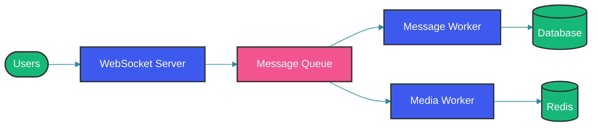
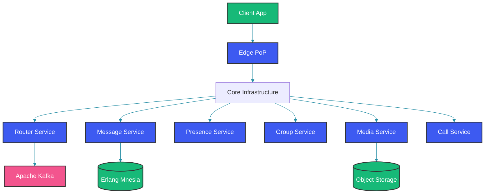

# WhatsApp Architecture

## Overview

WhatsApp serves over 2 billion users, handling more than 100 billion messages daily. The platform manages real-time bidirectional communication, media sharing, end-to-end encryption, and maintains 99.9% availability globally. This case study explores the architectural decisions and system design patterns that make this possible.

This guide covers WhatsApp's core requirements, messaging architecture, real-time communication patterns, storage design, and the techniques that enable massive scale.

## System Requirements

### Functional Requirements

1. **One-to-One Messaging**: Send and receive text, media, and status updates
2. **Group Messaging**: Support groups of up to 256+ members
3. **Media Sharing**: Share images, videos, documents with compression
4. **Status Updates**: Ephemeral status stories
5. **Voice/Video Calls**: Real-time audio and video communication
6. **Online Status**: Show when users are active
7. **Message Reactions**: React to messages with emoji
8. **Message Editing/Deletion**: Edit or delete sent messages

### Non-Functional Requirements

| Requirement | Target |
|---|---|
| Message delivery latency | < 100ms |
| Media upload latency | < 2s |
| Call setup time | < 3s |
| Availability | 99.9% |
| Message reliability | 99.999% |
| End-to-end encryption | Default on |

### Scale Estimates

| Metric | Value |
|---|---|
| Daily messages | 100B+ |
| Daily calls | 100M+ |
| Peak QPS (messages) | 10M+ |
| Peak QPS (notifications) | 50M+ |
| Media storage | Exabytes |
| Active connections | 50M+ |

## High-Level Architecture



## Real-Time Messaging

### WebSocket Connection Management

WhatsApp maintains persistent WebSocket connections for real-time message delivery:

```java
public class ConnectionManager {
    // Active connections indexed by user
    private final ConcurrentHashMap<String, WebSocketSession> activeConnections = new ConcurrentHashMap<>();
    
    // Register new connection
    public void registerConnection(String userId, WebSocketSession session) {
        // Remove old connection if exists
        WebSocketSession old = activeConnections.put(userId, session);
        if (old != null) {
            old.close(CloseReason.GOING_AWAY);
        }
        
        // Update presence
        presenceService.setOnline(userId);
    }
    
    // Send message through connection
    public CompletableFuture<Void> sendMessage(String userId, Message message) {
        WebSocketSession session = activeConnections.get(userId);
        if (session != null && session.isOpen()) {
            return session.sendText(message.toJson());
        }
        
        // Fallback to push notification
        return notificationService.sendPush(userId, message);
    }
}
```

### Binary Protocol

For efficiency, WhatsApp uses a binary protocol instead of JSON:

```
┌──────────────────────────────────────────────────┐
│              WhatsApp Binary Protocol             │
├─────────────┬─────────────┬───────────────────────┤
│   Flag (8)  │  List Size  │  Node Data (Variable) │
└─────────────┴─────────────┴───────────────────────┘
```

### Message Format

```protobuf
message Message {
    MessageKey key = 1;
    MessageContent content = 2;
    MessageStatus status = 3;
    int64 timestamp = 4;
    ServerErrorInfo server_error = 5;
}

message MessageKey {
    string remote_jid = 1;  // Recipient
    string from_me = 2;         // Sent by me
    string id = 3;              // Unique message ID
    int64 participant = 4;       // For group messages
}
```

## Message Flow

### Sending a Message

```
User A → App → Encrypt → [WebSocket] → Server → Store → ACK
                                         ↓
                                   [Queue]
                                         ↓
                              [Delivery Workers] → User B (Online)
                                         ↓
                              [Push Notification] → User B (Offline)
```

### Client-Side Message Processing

```java
public class MessageService {
    
    public CompletableFuture<MessageResult> sendMessage(String recipientId, MessageContent content) {
        // Generate unique message ID
        String messageId = generateMessageId();
        
        // Encrypt message content
        EncryptedMessage encrypted = encryptionService.encrypt(
            content, 
            recipientId
        );
        
        // Create message with key
        Message message = Message.builder()
            .key(MessageKey.builder()
                .remoteJid(recipientId)
                .fromMe(true)
                .id(messageId)
                .build())
            .content(encrypted)
            .status(MessageStatus.PENDING)
            .timestamp(currentTimeMillis())
            .build();
        
        // Save locally first (optimistic)
        localDatabase.save(message);
        
        // Send to server
        return webSocketClient.sendMessage(message)
            .thenApply(response -> {
                message.setStatus(MessageStatus.SENT);
                localDatabase.update(message);
                return MessageResult.success(messageId);
            })
            .exceptionally(e -> {
                message.setStatus(MessageStatus.FAILED);
                localDatabase.update(message);
                return MessageResult.failure(e.getMessage());
            });
    }
}
```

### Server-Side Processing

```java
@Service
public class MessageRouter {
    
    public CompletableFuture<Void> routeMessage(Message message) {
        MessageKey key = message.getKey();
        
        // Store in message store
        messageStore.save(message);
        
        // Determine recipients
        Set<String> recipients = determineRecipients(key);
        
        // Publish to delivery queue
        for (String recipient : recipients) {
            deliveryQueue.send(
                DeliveryMessage.builder()
                    .recipient(recipient)
                    .message(message)
                    .build()
            );
        }
        
        // Send receipt to sender
        sendReceipt(key, MessageStatus.SERVER_ACK);
        
        return CompletableFuture.completedFuture(null);
    }
}
```

## Presence Management

### Online Status Tracking

```java
public class PresenceService {
    // Last seen timestamps
    private final ConcurrentHashMap<String, Long> lastSeen = new ConcurrentHashMap<>();
    
    // Online users
    private final BitSet onlineUsers = new BitSet();
    
    public void setOnline(String userId) {
        onlineUsers.set(userId.hashCode());
        lastSeen.put(userId, System.currentTimeMillis());
    }
    
    public void setOffline(String userId) {
        onlineUsers.clear(userId.hashCode());
        lastSeen.put(userId, System.currentTimeMillis());
    }
    
    public Presence getPresence(String userId) {
        if (onlineUsers.get(userId.hashCode())) {
            return Presence.ONLINE;
        }
        Long lastSeenTime = lastSeen.get(userId);
        return lastSeenTime != null 
            ? Presence.offline(lastSeenTime) 
            : Presence.UNKNOWN;
    }
}
```

### Presence Broadcast

```java
public class PresenceNotifier {
    
    @Scheduled(fixedRate = 5, TimeUnit.SECONDS)
    public void broadcastPresenceChanges() {
        List<PresenceChange> changes = presenceChangeQueue.drainAll();
        
        // Group by user
        Map<String, List<PresenceChange>> grouped = changes.stream()
            .collect(Collectors.groupingBy(PresenceChange::getUserId));
        
        // Send to connected contacts
        for (Map.Entry<String, List<PresenceChange>> entry : grouped.entrySet()) {
            String userId = entry.getKey();
            List<PresenceChange> userChanges = entry.getValue();
            
            // Get user's contacts who are online
            List<String> contacts = contactService.getOnlineContacts(userId);
            
            for (String contact : contacts) {
                notifyPresence(contact, userChanges);
            }
        }
    }
}
```

## End-to-End Encryption

WhatsApp uses the Signal Protocol for end-to-end encryption:

### Key Generation

```java
public class SignalProtocolService {
    
    public IdentityKeyPair generateIdentityKeyPair() {
        KeyPair identityKey = Curve.generateKeyPair();
        return new IdentityKeyPair(identityKey);
    }
    
    public PreKeyBundle generatePreKeys(int startId, int count) {
        List<PreKey> preKeys = new ArrayList<>();
        for (int i = startId; i < startId + count; i++) {
            KeyPair keyPair = Curve.generateKeyPair();
            preKeys.add(new PreKey(i, keyPair));
        }
        
        SignedPreKey signedPreKey = generateSignedPreKey(identityKey, startId + count);
        
        return new PreKeyBundle(identityKey.getPublic(), signedPreKey, preKeys);
    }
}
```

### Session Establishment

```java
public class SessionBuilder {
    
    public void processPreKeyBundle(PreKeyBundle preKeyBundle, String recipientId) {
        // Create session for recipient
        SessionBuilder builder = new SessionBuilder(sessionStore, recipientId);
        
        // Process pre key bundle
        builder.processPreKeyBundle(preKeyBundle);
        
        // Store established session
        sessionStore.storeSession(recipientId, builder.getSession());
    }
}
```

### Message Encryption/Decryption

```java
public class SignalCipher {
    
    public CipherText encrypt(Message message, String recipientId) {
        Session session = sessionStore.loadSession(recipientId);
        CryptoSession cryptoSession = new CryptoSession(session);
        
        // Encrypt using Double Ratchet
        byte[] ciphertext = cryptoSession.encrypt(message.serialize());
        
        return CipherText.builder()
            .type(CipherTextType.PREKEY_WHATSAPP)
            .sessionId(session.getSenderRatchetKey())
            .ciphertext(ciphertext)
            .build();
    }
    
    public Message decrypt(CipherText cipherText) {
        Session session = sessionStore.loadSession(cipherText.getSenderId());
        CryptoSession cryptoSession = new CryptoSession(session);
        
        byte[] plaintext = cryptoSession.decrypt(cipherText.getCiphertext());
        return Message.parseFrom(plaintext);
    }
}
```

## Media Handling

### Media Upload Flow

```
Client → Encrypt Media → Chunk Upload → Server → Process → Store → Notify Recipient
                                              ↓
                                    ┌─────────────────┐
                                    │  - Resize       │
                                    │  - Compress    │
                                    │  - Generate   │
                                    │    thumbnails │
                                    └─────────────────┘
```

### Media Processing Pipeline

```java
@Service
public class MediaProcessor {
    
    public MediaMetadata processImage(byte[] data, String mediaType) {
        // Read image
        BufferedImage image = ImageIO.read(new ByteArrayInputStream(data));
        
        // Generate thumbnail
        BufferedImage thumbnail = resizeImage(image, 100, 100);
        
        // Compress main image
        byte[] compressed = compressImage(image, 85);
        
        // Generate preview (blur/low quality)
        byte[] preview = generatePreview(image);
        
        return MediaMetadata.builder()
            .originalData(compressed)
            .thumbnail(thumbnail)
            .preview(preview)
            .width(image.getWidth())
            .height(image.getHeight())
            .build();
    }
    
    public MediaMetadata processVideo(byte[] data, MediaType mediaType) {
        // Extract keyframes
        List<byte[]> thumbnails = extractVideoThumbnails(data);
        
        // Compress video
        byte[] compressed = compressVideo(data);
        
        return MediaMetadata.builder()
            .originalData(compressed)
            .thumbnail(thumbnails.get(0))
            .thumbnails(thumbnails)
            .build();
    }
}
```

### Media Encoding

```java
public class MediaEncoder {
    
    public String uploadMedia(byte[] data, MediaType type) {
        // Generate media hash
        String hash = Sha256.hash(data);
        
        // Check if already uploaded
        if (mediaStore.exists(hash)) {
            return hash;
        }
        
        // Upload to storage
        String location = objectStorage.upload(data);
        
        // Save metadata
        MediaMetadata metadata = MediaMetadata.builder()
            .hash(hash)
            .location(location)
            .size(data.length)
            .type(type)
            .build();
        
        mediaStore.save(metadata);
        
        return hash;
    }
}
```

## Data Storage

### Message Storage (Erlang Backend)

WhatsApp was originally built on Erlang/OTP for its hot-swap code capabilities:

```erlang
% Message storage in Erlang
-module(waim_message_storage).
-export([save_message/1, get_messages/2]).

-record(message, {
    id,
    from_jid,
    to_jid,
    content,
    timestamp,
    status
}).

save_message(Message) ->
    mnesia:dirty_write(Message).

get_messages(Jid, Afterstamp) ->
    Match = #message{
        id = '$1',
        to_jid = Jid,
        timestamp = '$2',
        _ = '_'
    },
    Guard = [{'>=', '$2', AfterStamp}],
    mnesia:dirty_select(Message, [{Match, Guard, ['$1']}]).
```

### Contact and Sync Data (RocksDB)

```java
// RocksDB for contacts and sync
RocksDB.open(
    new Options()
        .createIfMissing(true)
        .optimizeLevelStyleCompaction(3),
    "whatsapp_contacts"
);

// Contact storage
public class ContactStore {
    
    public void saveContact(Contact contact) {
        byte[] key = contact.getJid().getBytes();
        byte[] value = contact.serialize();
        
        db.put(key, value);
    }
    
    public Contact getContact(String jid) {
        byte[] value = db.get(jid.getBytes());
        return value != null ? Contact.deserialize(value) : null;
    }
}
```

### Media Storage

- **Object Storage**: Store on S3-compatible storage
- **CDN Distribution**: CloudFront for delivery
- **Encryption**: Encrypt at rest and in transit
- **Deduplication**: Hash-based deduplication

## Group Messaging

### Group Creation

```java
@Service
public class GroupService {
    
    public Group createGroup(String creatorJid, String name, List<String> memberJids) {
        // Generate group ID
        String groupId = generateGroupId();
        
        // Create group metadata
        Group group = Group.builder()
            .id(groupId)
            .creator(creatorJid)
            .name(name)
            .participants(memberJids)
            .build();
        
        // Store group
        groupStore.save(group);
        
        // Create group announce message
        messageService.sendGroupAnnounce(groupId, GroupEvent.CREATED);
        
        return group;
    }
}
```

### Group Message Fan-out

```java
public void handleGroupMessage(GroupMessage message) {
    String groupId = message.getGroupId();
    
    // Get group members
    Group group = groupStore.get(groupId);
    List<String> members = group.getMembers();
    
    // Send to each member
    for (String member : members) {
        // Skip sender
        if (member.equals(message.getSender())) {
            continue;
        }
        
        // Fan-out message
        deliverToMember(member, message);
    }
}
```

## Scaling Architecture

### Multi-Data Center Setup

```
┌─────────────────────────────────────────────────────────────────┐
│                  Global DNS / Anycast                          │
│                 (route closest to user)                        │
└─────────────────────────┬───────────────────────────────────────┘
                      │
          ┌───────────┼───────────┐
          │           │           │
          ▼           ▼           ▼
    ┌───────────┐   ┌───────────┐   ┌───────────┐
    │ US East │   │ EU West │   │ AP South │
    │ Facility │   │ Facility │   │ Facility │
    └─────────┘   └─────────┘   └─────────┘
```

### Cross-Region Message Sync

```java
public class CrossRegionSync {
    
    // Sync messages between data centers
    @Scheduled(fixedRate = 1, TimeUnit.MINUTES)
    public void syncMessages() {
        // Get pending messages for other regions
        List<Message> pending = messageStore.getPendingForReplication();
        
        for (Message message : pending) {
            // Send to remote data center
            remoteDatacenter.send(message);
            
            // Mark replicated
            messageStore.markReplicated(message.getId());
        }
    }
}
```

### Connection Distribution

- **WebSocket Connections**: Distributed across connection servers
- **User-to-Server Affinity**: Same user always connects to same cluster
- **Server-to-User Routing**: Global routing table

## Message Delivery Guarantees

### ACK Pipeline

```java
enum MessageStatus {
    PENDING,           // Created locally
    SERVER_ACK,        // Server received
    DELIVERED,          // Recipient received
    READ,              // Recipient opened
    PLAYED,            // Audio/Video played
    FAILED,            // Failed to deliver
}

// Client sends ACK on receipt
public void onMessageReceived(MessageReceipt receipt) {
    messageStatusUpdateService.updateStatus(
        receipt.getMessageId(),
        MessageStatus.DELIVERED
    );
}

// Client sends READ on UI display
public void onMessageRead(String messageId) {
    messageStatusUpdateService.updateStatus(
        messageId,
        MessageStatus.READ
    );
}
```

### Offline Message Queuing

```java
public class OfflineMessageQueue {
    
    // Queue messages while offline
    public void queueMessage(Message message) {
        pendingMessages.add(message);
        
        if (isOnline()) {
            flushQueue();
        }
    }
    
    // Retry on reconnection
    public void flushQueue() {
        List<Message> toRetry = new ArrayList<>(pendingMessages);
        pendingMessages.clear();
        
        for (Message message : toRetry) {
            try {
                sendMessage(message);
            } catch (Exception e) {
                pendingMessages.add(message);
            }
        }
    }
}
```

## Push Notifications

### Multiple Push Providers

```java
public class PushNotificationService {
    
    public void sendPush(User user, Message message) {
        // Try FCM first (Android)
        if (user.hasFcmToken()) {
            fcmClient.send(user.getFcmToken(), notification);
        }
        
        // Try APNS (iOS)
        if (user.hasApnsToken()) {
            apnsClient.send(user.getApnsToken(), notification);
        }
        
        // Fallback to SMS for unregisterable devices
        if (!user.hasAnyPushToken()) {
            smsService.sendSms(user.getPhoneNumber(), message);
        }
    }
}
```

## Architecture Diagram



## Key Learnings

### Architecture Decisions

| Decision | Rationale |
|---|---|
| Custom binary protocol | Bandwidth efficiency for mobile |
| Persistent connections | Real-time delivery |
| Erlang/OTP | Hot code deployment |
| Signal Protocol | Proven E2E security |
| RocksDB | Fast key-value for contacts |
| Multi-region | Global low latency |

### Design Patterns Used

1. **Connection pool per user**: One persistent connection per user
2. **FAN-out for groups**: Fan-out message to group members
3. **Optimistic local storage**: Fast send, background sync
4. **Push fallback**: Offline notification
5. **E2E encryption by default**: Security first

## Summary

WhatsApp's architecture demonstrates several key principles:

1. **Real-time requires persistent connections**: WebSocket/WSS for low-latency delivery
2. **Mobile optimization matters**: Binary protocols, compression, battery efficiency
3. **Security is fundamental**: E2E encryption built in from the start
4. **Scale with geographic distribution**: Multiple data centers, local caching
5. **Reliability through redundancy**: Multiple push providers, message queues

The combination of these decisions enables WhatsApp to handle 100+ billion daily messages with 99.999% reliability.

---

## References

- [WhatsApp Engineering Blog](https://engineering.fb.com/)
- [Signal Protocol Documentation](https://signal.org/docs/)
- [Erlang/OTP](https://www.erlang.org/)
- [RocksDB](https://rocksdb.org/)