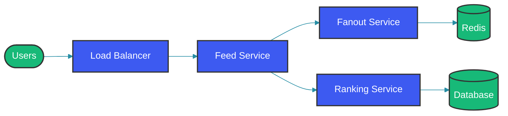
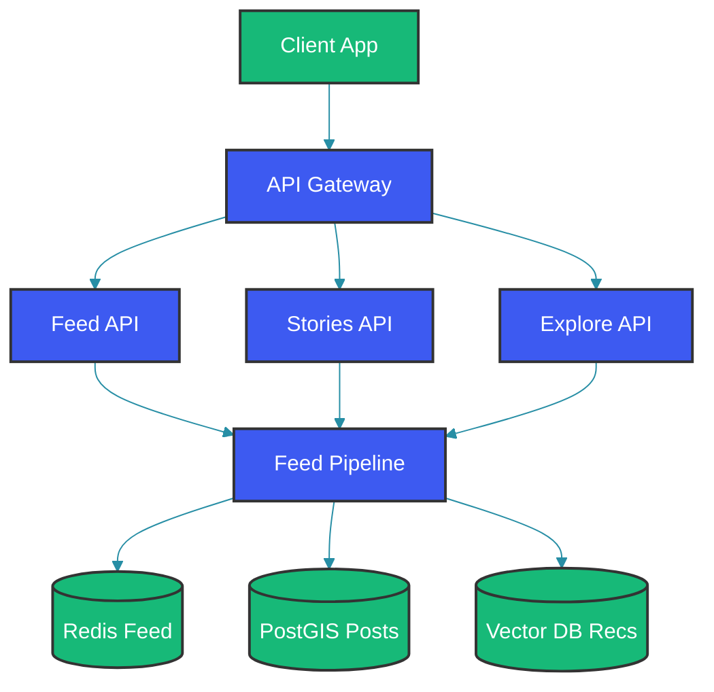

# Instagram Feed System Design

## Overview

Instagram's feed is one of the most complex content delivery systems in the world, serving over 2 billion users with personalized, chronologically ordered content from followed accounts, recommended posts, and advertisements. The system must balance relevance, recency, and diversity while maintaining sub-second loading times.

This guide explores designing a production-grade social feed system with content ranking, efficient fan-out, personalized recommendations, and real-time updates.

## Requirements

### Functional Requirements

1. **Feed Display**: Show posts from followed accounts
2. **Infinite Scroll**: Paginated feed loading
3. **Content Types**: Support images, videos, reels, stories
4. **Ranking**: Rank posts by relevance, recency
5. **Recommendations**: Suggest content from non-followed accounts
6. **Stories**: Display ephemeral stories at top
7. **Engagement**: Like, comment, share functionality
8. **Real-time Updates**: New posts appear without refresh

### Non-Functional Requirements

| Requirement | Target |
|---|---|
| Feed load time | < 500ms |
| Scroll smoothness | 60 FPS |
| Availability | 99.9% |
| Content freshness | < 5 min |
| Scalability | 10M+ QPS |

### Scale Estimates

| Metric | Value |
|---|---|
| Daily active users | 500M+ |
| Posts created daily | 100M+ |
| Feed QPS | 10M+ |
| Media storage | Exabytes |
| Feed size (posts) | 50-100 |

## Architecture Overview



## Feed Generation Strategies

### 1. Pull Model (Lazy Loading)

Retrieve posts on demand when user requests feed:

```
User Request → Fetch followed users' posts → Rank → Return → Display
```

**Implementation**:
```java
@Service
public class FeedService {
    
    public Feed getFeed(String userId, int limit, String cursor) {
        // Get user's following list
        List<String> following = followService.getFollowing(userId);
        
        // Get latest posts from followed
        List<Post> posts = postRepository.findPostsByUsers(
            following,
            cursor,
            limit
        );
        
        // Rank posts
        List<RankedPost> rankedPosts = rankingEngine.rank(posts, userId);
        
        return Feed.builder()
            .posts(rankedPosts)
            .nextCursor(rankedPosts.getLastCursor())
            .build();
    }
}
```

**Advantages**:
- Always up-to-date
- Lower storage cost
- Simple implementation

**Disadvantages**:
- Higher query latency
- Expensive for users with many follows

### 2. Push Model (Fan-out on Write)

Pre-generate feeds when new content is posted:

```
New Post → Fan-out to followers' pre-computed feeds → Push notification
```

**Implementation**:
```java
@Service
public class FanoutService {
    
    public void fanoutPost(Post post) {
        List<String> followers = followService.getFollowers(post.getAuthorId());
        
        // Parallel fanout to followers
        for (List<String> batch : split(followers, 1000)) {
            fanoutQueue.send(batch, post);
        }
    }
    
    @Service
    public class FanoutWorker {
        
        public void processFanoutBatch(FanoutBatch batch) {
            for (String userId : batch.getFollowers()) {
                // Add to user's feed
                feedCache.prepend(userId, batch.getPost());
                
                // Update feed metadata
                feedMetadataService.updateUnreadCount(userId);
            }
        }
    }
}
```

**Advantages**:
- Fast feed retrieval
- Better read latency
- Predictable performance

**Disadvantages**:
- Storage overhead
- Delayed delivery (minutes)
- Expensive for high followers

### 3. Hybrid Model

Combine both approaches:

```java
@Service
public class HybridFeedService {
    
    public Feed getFeed(String userId, int limit, String cursor) {
        // Get cached pre-computed feed
        List<Post> cachedPosts = feedCache.getRange(userId, limit);
        
        // Merge with new posts since cache
        List<Post> newPosts = postRepository.getNewPosts(
            userId,
            feedCache.getLastTimestamp(userId)
        );
        
        // Merge and rank
        List<Post> merged = mergeAndDedupe(cachedPosts, newPosts);
        List<RankedPost> ranked = rankingEngine.rank(merged, userId);
        
        return Feed.builder()
            .posts(ranked)
            .build();
    }
}
```

## Feed Ranking Algorithm

### Ranking Factors

| Factor | Weight | Description |
|--------|--------|-------------|
| Recency | 30% | Newer posts appear higher |
| Affinity | 25% | Posts from engaged accounts |
| Relationship | 20% | Close friends, family |
| Engagement | 15% | Likes, comments, shares |
| Diversity | 10% | Mix of content types |

### Ranking Implementation

```java
@Service
public class FeedRankingEngine {
    
    public List<RankedPost> rank(List<Post> posts, String userId) {
        // Get user features
        UserFeatures userFeatures = userFeatureService.getFeatures(userId);
        
        // Score each post
        List<PostScore> scores = posts.stream()
            .map(post -> calculateScore(post, userFeatures))
            .collect(Collectors.toList());
        
        // Sort by score
        scores.sort((a, b) -> b.getScore().compareTo(a.getScore()));
        
        // Apply diversity
        return applyDiversity(scores);
    }
    
    private double calculateScore(Post post, UserFeatures userFeatures) {
        double recencyScore = calculateRecency(post.getCreatedAt());
        double affinityScore = calculateAffinity(post.getAuthorId(), userFeatures);
        double relationshipScore = calculateRelationship(post.getAuthorId(), userFeatures);
        double engagementScore = calculateEngagement(post.getEngagement());
        double relevanceScore = calculateRelevance(post.getContent(), userFeatures);
        
        return recencyScore * 0.30 +
               affinityScore * 0.25 +
               relationshipScore * 0.20 +
               engagementScore * 0.15 +
               relevanceScore * 0.10;
    }
}
```

### Recency Calculation

```java
private double calculateRecency(Instant timestamp) {
    long minutesOld = java.time.Duration.between(timestamp, Instant.now()).toMinutes();
    return 1.0 / (1.0 + Math.log1p(minutesOld));
}
```

### Affinity Calculation

```java
private double calculateAffinity(String authorId, UserFeatures userFeatures) {
    EngagementHistory engagement = userFeatures.getEngagementHistory(authorId);
    
    if (engagement == null) {
        return 0.0;
    }
    
    double likeWeight = engagement.getLikes() * 1.0;
    double commentWeight = engagement.getComments() * 2.0;
    double shareWeight = engagement.getShares() * 3.0;
    double viewWeight = engagement.getViews() * 0.5;
    
    return likeWeight + commentWeight + shareWeight + viewWeight;
}
```

## Stories Implementation

### Stories Data Model

```sql
CREATE TABLE stories (
    id UUID PRIMARY KEY,
    user_id UUID NOT NULL,
    media_url TEXT NOT NULL,
    media_type ENUM('image', 'video'),
    duration INT DEFAULT 15000,
    created_at TIMESTAMP DEFAULT CURRENT_TIMESTAMP,
    expires_at TIMESTAMP GENERATED ALWAYS AS (created_at + INTERVAL '24 hours'),
    views_count INT DEFAULT 0,
    replies_count INT DEFAULT 0,
    
    INDEX idx_user_created (user_id, created_at)
);

CREATE TABLE story_views (
    id UUID PRIMARY KEY,
    story_id UUID REFERENCES stories(id),
    user_id UUID REFERENCES users(id),
    created_at TIMESTAMP DEFAULT CURRENT_TIMESTAMP,
    
    UNIQUE INDEX (story_id, user_id)
);
```

### Stories Display

```java
@Service
public class StoriesService {
    
    public Stories getStories(String userId) {
        // Get following users' stories
        List<String> following = followService.getFollowing(userId);
        
        // Get active stories (< 24 hours old)
        List<Story> stories = storyRepository.findActiveStories(following);
        
        // Group by user (for ring display)
        Map<String, List<Story>> storiesByUser = stories.stream()
            .collect(Collectors.groupingBy(Story::getUserId));
        
        // Build stories ring response
        return buildStoriesResponse(storiesByUser);
    }
}
```

## Real-Time Feed Updates

### WebSocket for New Posts

```java
@Service
public class RealTimeFeedService {
    
    @Autowired
    private WebSocketClient webSocketClient;
    
    public void onNewPost(Post post) {
        // Get followers with active connections
        List<String> onlineFollowers = presenceService.getOnlineUsers(
            post.getAuthorId()
        );
        
        // Send real-time update via WebSocket
        for (String follower : onlineFollowers) {
            webSocketClient.send(follower, buildFeedUpdate(post));
        }
        
        // Update unread counts for offline users
        for (String offlineFollower : getOfflineFollowers(post.getAuthorId())) {
            feedService.incrementUnreadCount(offlineFollower);
        }
    }
}
```

### Polling for Mobile Clients

```java
@RestController
public class FeedController {
    
    @GetMapping("/api/v1/feed")
    public Feed getFeed(
            @RequestParam String cursor,
            @RequestParam(defaultValue = "10") int limit) {
        
        // Get cached feed
        List<Post> cachedPosts = feedCache.getRange(cursor, limit);
        
        // Check for new content since cursor
        Map<String, Long> cursorTime = parseCursor(cursor);
        List<Post> newPosts = postRepository.getNewerThan(cursorTime.get("timestamp"));
        
        // Merge results
        return mergeAndRank(cachedPosts, newPosts);
    }
}
```

## Caching Strategy

### Multi-Level Cache

```java
@Configuration
public class FeedCacheConfig {
    
    @Bean
    public CacheManager feedCacheManager() {
        // L1: Local cache (Caffeine)
        CacheManager localCache = CaffeineCacheManager.create()
            .withSpec(Caffeine.newBuilder()
                .maximumSize(500)
                .expireAfterWrite(5, TimeUnit.MINUTES))
            .getCacheManager();
        
        // L2: Distributed cache (Redis)
        CacheManager redisCache = RedisCacheManager.create(redisTemplate);
        
        // Composite
        return new CompositeCacheManager(localCache, redisCache);
    }
}
```

### Cache Invalidation

```java
public class FeedCacheService {
    
    public void invalidateUserFeed(String userId) {
        // Invalidate feed cache
        feedCache.invalidate("feed:" + userId);
        feedCache.invalidate("feed:unread:" + userId);
        
        // Publish invalidation event
        redisTemplate.convertAndSend("feed:invalidate", userId);
    }
}
```

## Explore/Recommendations

### Recommendation System

```
┌─────────────────────────────────────────────────────────────────┐
│              Explore/Recommendations                         │
├────────────────────────────────────────────┤
│                                             │
│  ┌──────────────┐    ┌──────────────┐        │
│  │   User    │───▶│   Vector   │        │
│  │  Features │    │ Similarity │        │
│  └──────────────┘    └──────┬───────┘        │
│                             │               │
│  ┌──────────────┐           │    ┌──────────┐ │
│  │  Content   │◀─────────���┤    │ Candidate│ │
│  │   Pool   │           │    │  Pool   │ │
│  └─────┬──────┘           │    └────┬─────┘ │
│        │                  │        │       │
│        └──────────────────┴────────┤     │
│                              ┌───────┴────┐ │
│                              │   Final    │ │
│                              │   Rank    │ │
│                              └───────────┘ │
└──────────────────────────────────────────┘
```

### Candidate Generation

```java
@Service
public class ExploreService {
    
    public List<Post> getCandidates(String userId, int limit) {
        // Get user's embedding
        UserEmbedding userEmbedding = embeddingService.getUserEmbedding(userId);
        
        // Find similar users' content
        List<Post> fromSimilarUsers = vectorDb.similar(
            userEmbedding,
            limit * 2
        );
        
        // Get trending content
        List<Post> trending = engagementService.getTrending(limit);
        
        // Get content-based recommendations
        List<Post> contentBased = contentBasedRecs.getRecommendations(userId, limit * 2);
        
        // Merge candidates
        return mergeCandidates(fromSimilarUsers, trending, contentBased);
    }
}
```

## Pagination

### Cursor-Based Pagination

```java
public class FeedCursor {
    private final String postId;
    private final Instant timestamp;
    private final String encoded;
    
    public static FeedCursor encode(String postId, Instant timestamp) {
        String data = postId + ":" + timestamp.toEpochMilli();
        return new FeedCursor(postId, timestamp, Base64.encode(data));
    }
    
    public static FeedCursor decode(String encoded) {
        String decoded = Base64.decode(encoded);
        String[] parts = decoded.split(":");
        return new FeedCursor(parts[0], Instant.ofEpochMilli(Long.parseLong(parts[1])), encoded);
    }
}
```

### Pagination Response

```java
public Feed getFeed(String userId, String cursor, int limit) {
    // Parse cursor
    FeedCursor feedCursor = cursor != null 
        ? FeedCursor.decode(cursor) 
        : FeedCursor.start();
    
    // Get posts
    List<Post> posts = feedService.getPosts(userId, feedCursor, limit + 1);
    
    // Check if more posts
    boolean hasMore = posts.size() > limit;
    if (hasMore) {
        posts = posts.subList(0, limit);
    }
    
    // Build next cursor
    String nextCursor = hasMore 
        ? FeedCursor.encode(posts.getLast().getId(), posts.getLast().getCreatedAt())
        : null;
    
    return Feed.builder()
        .posts(posts)
        .nextCursor(nextCursor)
        .hasMore(hasMore)
        .build();
}
```

## Media Handling

### Media Caching

```java
public class MediaService {
    
    public String uploadMedia(Media media) {
        // Generate ID
        String mediaId = generateMediaId();
        
        // Upload to storage
        String location = objectStorage.upload(
            media.getData(),
            "/media/" + mediaId
        );
        
        // Generate thumbnails
        List<String> thumbnails = generateThumbnails(media);
        
        // Save metadata
        saveMediaMetadata(mediaId, location, thumbnails);
        
        return mediaId;
    }
    
    public List<String> generateThumbnails(Media media) {
        if (media.getType() == MediaType.IMAGE) {
            return List.of(
                resizeImage(media, 150, 150),
                resizeImage(media, 320, 320),
                resizeImage(media, 640, 640)
            );
        } else {
            return extractKeyframes(media);
        }
    }
}
```

## Architecture Diagram



## Performance Optimization

### Prefetching Next Page

```java
@Service
public class FeedPrefetchService {
    
    @Scheduled(fixedRate = 1000)
    public void prefetchFeeds() {
        // Get users who are likely to request feed soon
        List<String> activeUsers = userActivityService.getActiveUsers();
        
        for (String userId : activeUsers) {
            // Prefetch next page
            prefetchFeedPage(userId);
        }
    }
}
```

### Connection Pooling

```java
@Configuration
public class DatabaseConfig {
    
    @Bean
    public DataSource dataSource() {
        HikariConfig config = new HikariConfig();
        config.setMaximumPoolSize(50);
        config.setMinimumIdle(10);
        config.setConnectionTimeout(5000);
        config.setIdleTimeout(600000);
        config.setMaxLifetime(1800000);
        
        return new HikariDataSource(config);
    }
}
```

## Monitoring

### Key Metrics

| Metric | Description | Target |
|--------|-------------|--------|
| Feed latency (P95) | Feed generation time | < 500ms |
| Scroll FPS | Smoothness | 60 |
| Cache hit ratio | % cached | > 90% |
| New posts in feed | Freshness | < 5 min |
| Engagement rate | Clicks/likes | > 5% |

### Observability

```java
@Aspect
public class FeedMetricsAspect {
    
    @AfterReturning("execution(* FeedService.getFeed(..))")
    public void recordFeedFetch(JoinPoint joinPoint) {
        long latency = System.currentTimeMillis() - startTime;
        metrics.histogram("feed_fetch_latency", latency)
            .tag("user_id", userId);
    }
}
```

## Best Practices

1. **Use hybrid feed generation**: Combine pre-computed and real-time for best performance.
2. **Rank holistically**: Consider recency, affinity, relationship, and engagement.
3. **Cache aggressively**: 90%+ cache hit ratio should be the target.
4. **Prefetch strategically**: Pre-compute feeds for active users.
5. **Paginate with cursors**: Cursor-based pagination handles real-time data better.
6. **Monitor freshness**: Ensure users see new content quickly.
7. **Optimize for scrolling**: Prefetch next page during scroll.

## Common Mistakes

1. **Pull-only for large following**: Query becomes too slow.
2. **Push-only for viral content**: Fan-out becomes too expensive.
3. **Ignoring diversity**: Feed becomes homogeneous.
4. **Poor cache hit ratio**: Causes slow feeds.
5. **Not handling real-time**: New posts don't appear immediately.

## Summary

Instagram's feed is a sophisticated system combining multiple strategies:

1. **Hybrid generation**: Pre-computed feeds + real-time merge
2. **Multi-factor ranking**: Recency, affinity, engagement, diversity
3. **Aggressive caching**: Multiple cache layers
4. **Real-time updates**: WebSocket for live content
5. **Explore recommendations**: ML-based content discovery

The key is balancing freshness, relevance, and performance while scaling to billions of users.

---

## References

- [Instagram Engineering](https://engineering.instagram.com/)
- [Feed Ranking Paper](https://research.fb.com/)
- [Recommendation Systems](https://netflixtechblog.com/)
- [Twitter Timeline](https://blog.twitter.com/)