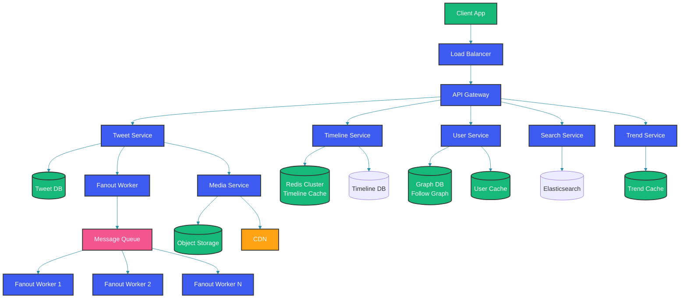

# Design Twitter (X) - System Design

## Overview

Twitter (X) serves over 500 million daily active users, handling 500 million+ tweets per day with sub-second timeline loading. This case study explores the architectural decisions behind tweet creation, timeline generation, search, trending topics, and the caching strategies that make it scale.

## System Requirements

### Functional Requirements

1. **Post Tweet**: Users create tweets (280 chars, media attachments)
2. **Timeline**: Home timeline showing tweets from followed users
3. **User Timeline**: View a specific user's tweets
4. **Search**: Full-text search across tweets
5. **Trends**: Trending topics based on tweet volume
6. **Engage**: Like, retweet, reply, bookmark
7. **Follow/Unfollow**: Manage social graph

### Non-Functional Requirements

| Requirement | Target |
|---|---|
| Tweet delivery latency | < 5s (eventual consistency) |
| Timeline load time | < 500ms |
| Availability | 99.95% |
| Write throughput | 10K+ tweets/sec peak |
| Read throughput | 100K+ timeline loads/sec |

### Scale Estimates

| Metric | Value |
|---|---|
| DAU | 500M+ |
| Tweets/day | 500M+ |
| Follows/user (avg) | 200 |
| Timeline loads/day | 10B+ |
| Storage/day | 50TB+ (including media) |

## High-Level Architecture



## Tweet Creation

### Tweet Service

```java
@Service
public class TweetService {
    
    private final SnowflakeIdGenerator idGenerator;
    private final TweetRepository tweetRepository;
    private final FanoutService fanoutService;
    private final MediaService mediaService;
    
    public Tweet createTweet(CreateTweetRequest request, String userId) {
        // Generate unique tweet ID
        long tweetId = idGenerator.nextId();
        
        // Process media attachments
        List<Media> media = request.getMediaIds().stream()
            .map(mediaService::getMedia)
            .collect(Collectors.toList());
        
        // Build tweet entity
        Tweet tweet = Tweet.builder()
            .id(tweetId)
            .userId(userId)
            .content(sanitizeContent(request.getContent()))
            .media(media)
            .createdAt(Instant.now())
            .metrics(TweetMetrics.empty())
            .build();
        
        // Persist to database
        tweetRepository.save(tweet);
        
        // Index for search
        searchService.indexTweet(tweet);
        
        // Fanout to followers
        fanoutService.fanoutTweet(tweet, userId);
        
        return tweet;
    }
    
    private String sanitizeContent(String content) {
        // Validate length, filter spam, apply content policies
        if (content.length() > 280) {
            throw new TweetTooLongException("Tweet exceeds 280 characters");
        }
        // URL shortening, hashtag extraction, mention detection
        return contentFormatter.format(content);
    }
}
```

## Timeline Generation

### Fanout on Write (for regular users)

For users with up to ~100K followers, tweet fanout happens at write time:

```java
@Service
public class FanoutService {
    private static final long FANOUT_THRESHOLD = 100_000; // Celebrities
    
    private final FollowGraphService followGraph;
    private final TimelineCache timelineCache;
    
    public void fanoutTweet(Tweet tweet, String userId) {
        long followerCount = followGraph.getFollowerCount(userId);
        
        if (followerCount <= FANOUT_THRESHOLD) {
            // Fanout on write: insert tweet into all followers' timelines
            fanoutToFollowers(tweet, userId);
        } else {
            // Fanout on read: celebrity tweets fetched at read time
            timelineCache.addToCelebrityTimeline(userId, tweet);
        }
    }
    
    private void fanoutToFollowers(Tweet tweet, String userId) {
        // Batch process followers
        List<String> followers = followGraph.getFollowers(userId);
        
        // Partition into batches of 1000
        List<List<String>> batches = Lists.partition(followers, 1000);
        
        for (List<String> batch : batches) {
            fanoutWorker.submit(() -> {
                for (String followerId : batch) {
                    // Prepend tweet to follower's timeline
                    timelineCache.pushToTimeline(followerId, tweet.getId());
                }
            });
        }
    }
}
```

### Fanout on Read (for celebrities)

```java
@Service
public class TimelineService {
    
    private final TimelineCache timelineCache;
    private final FollowGraphService followGraph;
    private final TweetRepository tweetRepository;
    
    public Timeline getHomeTimeline(String userId, TimelineRequest request) {
        // 1. Get cached timeline (fanout-on-write tweets)
        List<Long> cachedTweetIds = timelineCache.getTimeline(
            userId, request.getPage(), request.getSize());
        
        // 2. Get celebrity tweets (fanout on read)
        Set<String> following = followGraph.getFollowing(userId);
        List<String> celebrities = followGraph.getCelebrities(following);
        
        List<Tweet> celebrityTweets = tweetRepository.getRecentTweets(
            celebrities, request.getCursor(), 10);
        
        // 3. Merge and sort by timestamp
        List<Tweet> cachedTweets = tweetRepository.findByIds(cachedTweetIds);
        
        List<Tweet> merged = mergeTimelines(cachedTweets, celebrityTweets);
        
        // 4. Apply ads and recommendations
        List<Tweet> promotedTweets = adService.getPromotedTweets(userId);
        
        // 5. Return paginated result
        return Timeline.builder()
            .tweets(interleave(merged, promotedTweets))
            .cursor(getNextCursor(merged))
            .build();
    }
}
```

## Twitter Search

```java
@Service
public class SearchService {
    
    private final ElasticsearchRestTemplate elasticsearchTemplate;
    
    public SearchResult search(SearchRequest request) {
        NativeSearchQuery searchQuery = new NativeSearchQueryBuilder()
            .withQuery(QueryBuilders.functionScoreQuery(
                QueryBuilders.boolQuery()
                    .must(QueryBuilders.multiMatchQuery(request.getQuery())
                        .field("content", 2.0f)
                        .field("hashtags", 3.0f)
                        .field("user.displayName", 1.5f))
                    .filter(QueryBuilders.termQuery("lang", request.getLang()))
                    .filter(QueryBuilders.rangeQuery("createdAt")
                        .gte(request.getSince()))
            ))
            .withPageable(PageRequest.of(request.getPage(), request.getSize()))
            .withSort(SortBuilders.scoreSort())
            .build();
        
        SearchHits<TweetDocument> hits = elasticsearchTemplate.search(
            searchQuery, TweetDocument.class);
        
        return SearchResult.builder()
            .tweets(hits.stream()
                .map(SearchHit::getContent)
                .map(this::toTweet)
                .collect(Collectors.toList()))
            .totalHits(hits.getTotalHits())
            .build();
    }
    
    @Data
    @Document(indexName = "tweets")
    public static class TweetDocument {
        @Id
        private Long id;
        @Field(type = FieldType.Text, analyzer = "twitter_analyzer")
        private String content;
        @Field(type = FieldType.Keyword)
        private List<String> hashtags;
        @Field(type = FieldType.Date)
        private Instant createdAt;
        @Field(type = FieldType.Long)
        private Long userId;
        @Field(type = FieldType.Integer)
        private Integer retweetCount;
        @Field(type = FieldType.Integer)
        private Integer likeCount;
    }
}
```

## Trending Topics

```java
@Service
public class TrendService {
    
    private final SlidingWindowCounter trendCounter;
    private final Cache<String, TrendScore> trendCache;
    
    public TrendService() {
        // 10-minute sliding window, partitioned into 1-minute buckets
        this.trendCounter = new SlidingWindowCounter(10, 1, TimeUnit.MINUTES);
        this.trendCache = Caffeine.newBuilder()
            .maximumSize(1000)
            .expireAfterWrite(2, TimeUnit.MINUTES)
            .build();
    }
    
    public void recordHashtag(String hashtag) {
        trendCounter.increment(hashtag.toLowerCase());
    }
    
    public List<Trend> getTrendingTopics(String locale) {
        Map<String, Long> counts = trendCounter.getCounts();
        
        return counts.entrySet().stream()
            .filter(e -> isTrending(e.getValue(), e.getKey()))
            .sorted(Map.Entry.<String, Long>comparingByValue().reversed())
            .limit(50)
            .map(entry -> Trend.builder()
                .hashtag("#" + entry.getKey())
                .tweetCount(entry.getValue())
                .rank(computeRank(entry.getValue()))
                .build())
            .collect(Collectors.toList());
    }
    
    private boolean isTrending(long count, String hashtag) {
        // Compare current count with historical baseline
        long historicalAvg = trendCounter.getHistoricalAverage(hashtag, 7, TimeUnit.DAYS);
        return count > historicalAvg * 2.0; // 2x surge threshold
    }
}
```

## Caching Strategy

```java
@Service
public class TwitterCacheStrategy {
    
    // Multi-tier caching
    private final Cache<String, UserProfile> localCache = Caffeine.newBuilder()
        .maximumSize(100_000)
        .expireAfterWrite(5, TimeUnit.MINUTES)
        .build();
    
    private final RedisTemplate<String, Object> redisCache;
    private final Database database;
    
    public UserProfile getUserProfile(String userId) {
        // L1: Local cache (application heap)
        UserProfile local = localCache.getIfPresent(userId);
        if (local != null) return local;
        
        // L2: Redis cache
        String cacheKey = "user:profile:" + userId;
        UserProfile cached = (UserProfile) redisCache.opsForValue().get(cacheKey);
        if (cached != null) {
            localCache.put(userId, cached);
            return cached;
        }
        
        // L3: Database
        UserProfile profile = database.findUserProfile(userId);
        
        // Populate caches
        redisCache.opsForValue().set(cacheKey, profile, 30, TimeUnit.MINUTES);
        localCache.put(userId, profile);
        
        return profile;
    }
}
```

## Best Practices

- Use hybrid fanout: fanout-on-write for regular users (<100K followers) and fanout-on-read for celebrities; this balances write amplification against timeline freshness
- Pre-compute timelines in Redis sorted sets for O(log N) insertion and O(1) range queries
- Implement timeline pagination using cursor-based pagination (tweet IDs as cursors) rather than offset-based to avoid performance degradation
- Use Elasticsearch for full-text search with custom analyzers for hashtags, mentions, and URL normalization
- Cache user profiles, follow graphs, and trending topics aggressively with multi-tier caches (local + Redis)
- Shard tweet storage by ID range or creation date for efficient time-range queries
- Handle viral events by rate-limiting fanout queues and prioritizing celebrity tweets differently

## Common Mistakes

- Fanning out every tweet to all followers regardless of follower count, causing massive write amplification for celebrity tweets (millions of writes per tweet)
- Using offset-based pagination for timeline queries, which degrades as the user scrolls deeper into their timeline
- Storing full tweet objects in timeline cache instead of just tweet IDs, wasting memory when the same tweet appears in many timelines
- Not handling the thundering herd problem when a celebrity tweets and all followers try to load their timelines simultaneously
- Ignoring data locality: storing hot celebrity tweets on the same database nodes creates hotspots under viral load
- Using synchronous fanout for all followers, blocking the tweet creation response for users with large follower counts

## Summary

Twitter's architecture demonstrates the power of hybrid fanout strategies, multi-tier caching, and careful separation of read and write paths. The key insight is that a one-size-fits-all approach to timeline generation doesn't work at scale: fanout-on-write for regular users provides fast reads, while fanout-on-read for celebrities avoids unsustainable write amplification. Caching at multiple levels (local, Redis, CDN) combined with pre-computed timelines enables sub-second timeline loads for 500M+ users.

## References

- [Twitter Engineering Blog](https://blog.twitter.com/engineering)
- [Timeline Scalability at Twitter](https://www.infoq.com/presentations/Twitter-Timeline-Scalability/)
- [Flocking: Birds of a Feather (Twitter's distributed system)](https://blog.twitter.com/engineering/en_us/a/2013/flocking-birds-of-a-feather)
- [Elasticsearch at Twitter](https://www.elastic.co/blog/twitter-elasticsearch)
