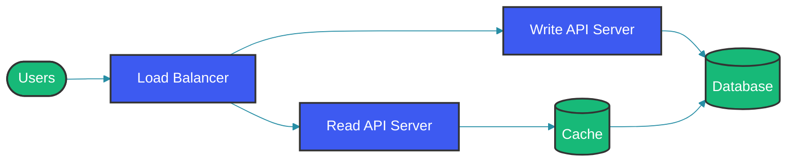
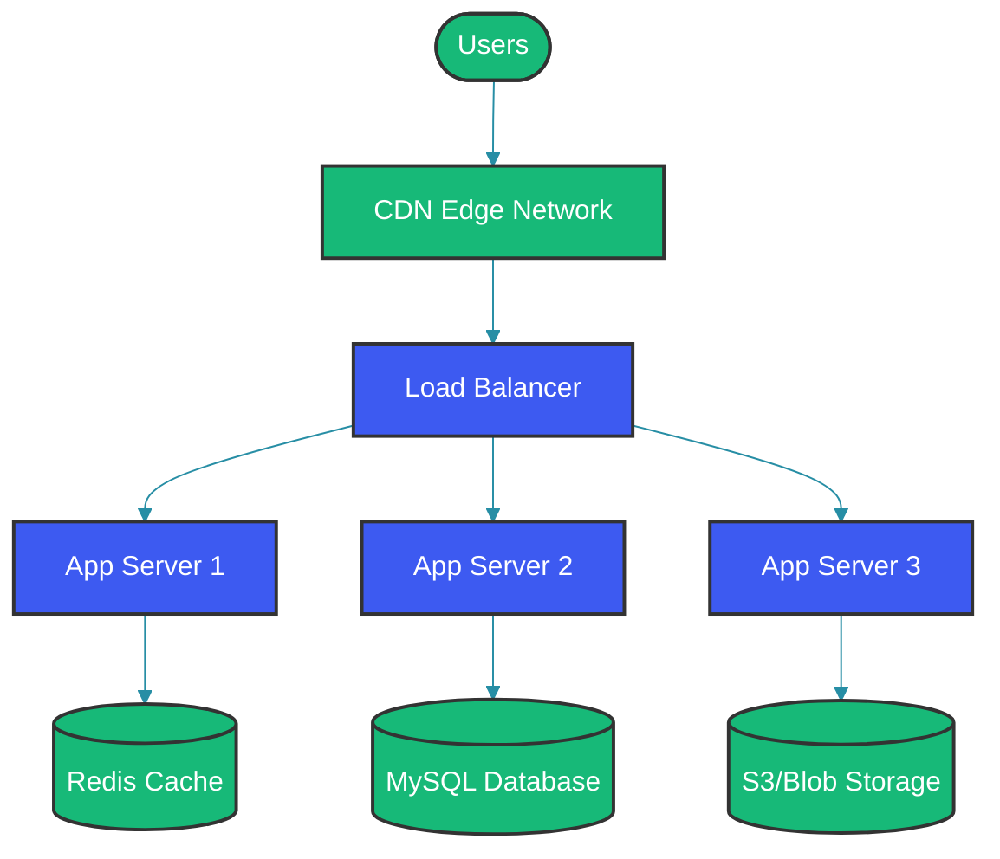

# URL Shortener System Design

## Overview

A URL shortener service transforms long, unwieldy URLs into short, shareable links. Services like bit.ly, TinyURL, andgoo.gl process billions of redirects daily while handling creation of millions of new short URLs. This case study explores designing a production-grade URL shortener system that can scale to handle these volumes.

This guide covers requirement gathering, high-level architecture, data model design, encoding strategies, and operational considerations for building a URL shortener service.

## Problem Statement

URL shorteners solve several problems:

**Shareability**: Long URLs are difficult to share in emails, messages, or social media with character limits.

**Trackability**: Short URLs enable tracking click-through rates, geographic distribution, and referrer analysis.

**Aesthetics**: Short URLs are more professional and easier to remember.

**Link Management**: Enables editing, expire dates, and custom aliases for enterprise use.

## Requirements

### Functional Requirements

1. **Short URL Creation**: Convert long URL to short URL
2. **Custom Aliases**: Support custom short codes (e.g., yoursite.com/facebook)
3. **Redirect**: Seamless redirect from short to long URL
4. **Analytics**: Track clicks, referrers, locations
5. **Link Management**: Edit, delete, expire links
6. **Bulk Operations**: Create/delete multiple URLs

### Non-Functional Requirements

1. **Availability**: 99.99% uptime (maximum 52 minutes/year downtime)
2. **Latency**: Sub-100ms redirect latency
3. **Scalability**: Support billions of URLs
4. **Durability**: Persist URLs indefinitely (with optional expiration)

### Scale Estimates

| Metric | Daily | Monthly | Yearly |
|--------|--------|----------|---------|
| URL creations | 10M | 300M | 3.6B |
| Redirects | 1B | 30B | 360B |
| Storage growth | 1TB | 30TB | 360TB |

### Traffic Patterns

- **Write-heavy**: 30% writes, 70% reads (creates vs. redirects)
- **Read latency critical**: Must be <100ms
- **Write latency moderate**: Can tolerate 500ms

## High-Level Architecture



## Data Model

### Database Schema

```sql
CREATE TABLE urls (
    id BIGINT PRIMARY KEY AUTO_INCREMENT,
    short_code VARCHAR(10) NOT NULL UNIQUE,
    original_url TEXT NOT NULL,
    custom_alias VARCHAR(50),
    user_id BIGINT,
    clicks INT DEFAULT 0,
    expires_at TIMESTAMP NULL,
    created_at TIMESTAMP DEFAULT CURRENT_TIMESTAMP,
    updated_at TIMESTAMP DEFAULT CURRENT_TIMESTAMP ON UPDATE CURRENT_TIMESTAMP,
    
    INDEX idx_short_code (short_code),
    INDEX idx_user_id (user_id),
    INDEX idx_expires_at (expires_at)
);

CREATE TABLE analytics (
    id BIGINT PRIMARY KEY AUTO_INCREMENT,
    short_code VARCHAR(10) NOT NULL,
    referrer VARCHAR(500),
    user_agent VARCHAR(500),
    country VARCHAR(2),
    ip_address VARCHAR(45),
    timestamp TIMESTAMP DEFAULT CURRENT_TIMESTAMP,
    
    INDEX idx_short_code_time (short_code, timestamp),
    INDEX idx_timestamp (timestamp)
);

CREATE TABLE users (
    id BIGINT PRIMARY KEY AUTO_INCREMENT,
    email VARCHAR(255) UNIQUE NOT NULL,
    password_hash VARCHAR(255) NOT NULL,
    plan ENUM('free', 'premium', 'enterprise') DEFAULT 'free',
    created_at TIMESTAMP DEFAULT CURRENT_TIMESTAMP
);

CREATE TABLE user_urls (
    user_id BIGINT,
    url_id BIGINT,
    PRIMARY KEY (user_id, url_id),
    FOREIGN KEY (user_id) REFERENCES users(id),
    FOREIGN KEY (url_id) REFERENCES urls(id)
);
```

### Data Modeling for Scale

For very high scale, consider time-based partitioning:

```sql
-- Daily partitions for analytics
ALTER TABLE urls PARTITION BY RANGE (TO_DAYS(created_at)) (
    PARTITION p2024_01 VALUES LESS THAN (TO_DAYS('2024-02-01')),
    PARTITION p2024_02 VALUES LESS THAN (TO_DAYS('2024-03-01')),
    PARTITION p_future VALUES LESS THAN MAXVALUE
);
```

## API Design

### RESTful API Endpoints

#### Create Short URL

```
POST /api/v1/urls
Content-Type: application/json
Authorization: Bearer <token>

Request:
{
    "url": "https://www.example.com/very/long/path/to/resource",
    "custom_alias": "facebook",  // optional
    "expires_in_days": 30       // optional
}

Response (201 Created):
{
    "short_url": "https://short.com/abc123",
    "short_code": "abc123",
    "original_url": "https://www.example.com/...",
    "expires_at": "2024-12-01T00:00:00Z",
    "created_at": "2024-11-01T00:00:00Z"
}
```

#### Get URL Info

```
GET /api/v1/urls/:shortCode

Response (200 OK):
{
    "short_code": "abc123",
    "original_url": "https://www.example.com/...",
    "clicks": 1542,
    "created_at": "2024-11-01T00:00:00Z",
    "expires_at": null
}
```

#### Update URL

```
PUT /api/v1/urls/:shortCode
Content-Type: application/json

Request:
{
    "original_url": "https://www.new-destination.com"
}

Response (200 OK):
{
    "short_code": "abc123",
    "original_url": "https://www.new-destination.com",
    "updated_at": "2024-11-02T00:00:00Z"
}
```

#### Delete URL

```
DELETE /api/v1/urls/:shortCode

Response (204 No Content)
```

#### Get Analytics

```
GET /api/v1/urls/:shortCode/analytics?from=2024-01-01&to=2024-01-31

Response (200 OK):
{
    "short_code": "abc123",
    "total_clicks": 1542,
    "clicks_by_country": {
        "US": 800,
        "IN": 300,
        "UK": 200,
        "OTHER": 242
    },
    "clicks_by_day": [...],
    "top_referrers": [...]
}
```

#### Bulk Create URLs

```
POST /api/v1/urls/bulk
Content-Type: application/json

Request:
{
    "urls": [
        {"url": "https://example.com/1"},
        {"url": "https://example.com/2"},
        {"url": "https://example.com/3"}
    ]
}

Response (200 OK):
{
    "urls": [
        {"short_code": "abc1", "short_url": "https://short.com/abc1"},
        {"short_code": "abc2", "short_url": "https://short.com/abc2"},
        {"short_code": "abc3", "short_url": "https://short.com/abc3"}
    ]
}
```

### Redirect Endpoints

```
GET /:shortCode → 301 Permanent Redirect to original_url
GET /:shortCode+? → 307 Temporary Redirect to original_url (for tracking)

Headers:
Location: https://original-url.com
```

## Short Code Generation

### Encoding Strategies

#### 1. Base62 Encoding (0-9, a-z, A-Z)

```java
private static final String ALPHABET = "0123456789abcdefghijklmnopqrstuvwxyzABCDEFGHIJKLMNOPQRSTUVWXYZ";

public String encode(long id) {
    StringBuilder sb = new StringBuilder();
    while (id > 0) {
        sb.append(ALPHABET.charAt((int) (id % 62)));
        id /= 62;
    }
    return sb.reverse().toString();
}

public long decode(String code) {
    long result = 0;
    for (int i = 0; i < code.length(); i++) {
        result = result * 62 + ALPHABET.indexOf(code.charAt(i));
    }
    return result;
}
```

**ID to Code Mapping**:
- ID 1 → "1"
- ID 61 → "z"
- ID 62 → "10"
- ID 238,328 → "zzz"

#### 2. Base58 Encoding (Bitcoin-style)

Excludes similar-looking characters (0, O, I, l):

```java
private static final String ALPHABET = "123456789abcdefghijkmnopqrstuvwxyzABCDEFGHJKLMNPQRSTUVWXYZ";
```

**Advantages**: Avoids confusion in printed URLs.

#### 3. Random Code Generation

```java
public String generateRandomCode() {
    SecureRandom random = new SecureRandom();
    byte[] bytes = new byte[6];
    random.nextBytes(bytes);
    return Base64.getUrlEncoder().withoutPadding().encodeToString(bytes).substring(0, 6);
}
```

**Advantages**: Codes are unpredictable.
**Disadvantages**: Collision detection required.

### Hybrid Approach

```
ID Generator: Auto-increment → Database ID (sequential)
Encoding: Base62(ID) → Short code (deterministic)
```

### Short Code Length Strategy

```java
public int calculateCodeLength(long totalUrls) {
    // 62^k >= totalUrls
    // For 1B URLs: 62^5 = 916M, 62^6 = 56B
    if (totalUrls < 62) return 1;
    if (totalUrls < 62L * 62) return 2;
    if (totalUrls < 62L * 62 * 62) return 3;
    // etc.
}
```

## Caching Strategy

### Cache-Aside for Redirects

```java
public String getOriginalUrl(String shortCode) {
    // Try cache first
    String url = cache.get(shortCode);
    if (url != null) {
        return url;
    }
    
    // Load from database
    url = urlRepository.findByShortCode(shortCode)
        .map(Url::getOriginalUrl)
        .orElse(null);
    
    if (url != null) {
        cache.set(shortCode, url, Duration.ofMinutes(10));
    }
    
    return url;
}
```

### Pre-populate Cache at Scale

```java
@Scheduled(fixedRate = 60000)
public void warmCache() {
    for (String code : hotUrls.getTop(10000)) {
        Url url = urlRepository.findByShortCode(code).orElse(null);
        if (url != null) {
            cache.set(code, url.getOriginalUrl());
        }
    }
}
```

## Analytics Implementation

### Asynchronous Analytics

```java
public void trackClick(String shortCode, HttpRequest request) {
    // Immediately return for redirect
    // Async analytics tracking
    
    AnalyticsEvent event = AnalyticsEvent.builder()
        .shortCode(shortCode)
        .referrer(request.getHeader("Referer"))
        .userAgent(request.getHeader("User-Agent"))
        .ipAddress(request.getRemoteAddress())
        .build();
    
    analyticsQueue.offer(event);
}

@Async
@Scheduled(fixedRate = 5000)
public void processAnalyticsEvents() {
    List<AnalyticsEvent> events = new ArrayList<>();
    analyticsQueue.drainTo(events, 1000);
    
    if (!events.isEmpty()) {
        analyticsRepository.batchInsert(events);
    }
}
```

### Aggregation Jobs

```sql
-- Daily aggregation
INSERT INTO daily_analytics (date, short_code, clicks)
SELECT CURDATE(), short_code, COUNT(*) 
FROM analytics 
WHERE timestamp >= CURDATE()
GROUP BY short_code;

-- Hourly aggregation for recent data
INSERT INTO hourly_analytics (hour, short_code, clicks)
SELECT HOUR(created_at), short_code, COUNT(*) 
FROM analytics 
WHERE timestamp >= DATE_SUB(NOW(), INTERVAL 25 HOUR)
GROUP BY HOUR(created_at), short_code;
```

## Scalability Considerations

### Read Scaling

```
┌────────────────────────────────────────────┐
│             Load Balancer                  │
└─────────┬───────────────┬─────────────────┘
          │               │
    ┌─────┴─────┐   ┌─────┴─────┐
    │  Cache    │   │   Cache   │ (Redis Cluster)
    │  Node 1  │   │   Node 2  │
    └─────┬─────┘   └─────┬─────┘
          │               │
          └───────┬───────┘
                  │
          ┌───────┴───────┐
          │              │
    ┌─────┴─────┐  ┌─────┴─────┐
    │  Primary  │  │ Replica 1 │
    │           │  │  (Reads)   │
    └───────────┘  └───────────┘
```

### Write Handling

- Auto-increment IDs in primary database
- Short codes derived deterministically
- Unique constraint violation rare (collision check)
- Retry with new ID if collision occurs

### CDN for Static Content

```
User Request CDN Edge → Cache Hit → Return
                    ↓ Cache Miss
                 Origin Server → Cache and Return
```

## Custom Aliases

### Reservation Requirements

```java
public boolean reserveCustomAlias(String alias, Long userId) {
    // Check if available
    if (urlRepository.existsByCustomAlias(alias)) {
        return false;
    }
    
    // Reserve
    urlRepository.reserveAlias(alias, userId);
    return true;
}
```

### Validation Rules

```java
public boolean isValidAlias(String alias) {
    // 3-50 characters
    if (alias.length() < 3 || alias.length() > 50) {
        return false;
    }
    
    // Alphanumeric and hyphens only
    if (!alias.matches("^[a-zA-Z0-9-]+$")) {
        return false;
    }
    
    // Reserved words blocked
    if (RESERVED.contains(alias.toLowerCase())) {
        return false;
    }
    
    return true;
}
```

## Security Considerations

### URL Validation

```java
public boolean isValidUrl(String url) {
    try {
        URI uri = new URI(url);
        
        // Only http/https
        if (!uri.getScheme().matches("https?")) {
            return false;
        }
        
        // No localhost or private ranges
        String host = uri.getHost();
        if (isPrivateAddress(host)) {
            return false;
        }
        
        return true;
    } catch (URISyntaxException e) {
        return false;
    }
}

private boolean isPrivateAddress(String host) {
    try {
        InetAddress address = InetAddress.getByName(host);
        return address.isSiteLocalAddress() || address.isLoopbackAddress();
    } catch (UnknownHostException e) {
        return true;
    }
}
```

### Rate Limiting

```java
@Configuration
public class RateLimitConfig {
    
    @Bean
    public Filter filter() {
        return new RateLimitFilter(
            RateLimitRule.withMaxRequests(100)
                .perSeconds(1)
                .forIp()
        );
    }
}
```

### Malicious URL Prevention

- Scan URLs for malware/phishing
- Block known malicious domains
- User reports
- Automated abuse detection

## Architecture Diagram



## Monitoring and Metrics

### Key Metrics to Track

| Metric | Description | Alert Threshold |
|--------|-------------|---------------|
| Redirect latency | P99 time for redirect | > 100ms |
| Create latency | P99 time for creation | > 500ms |
| Cache hit ratio | % of redirects from cache | < 90% |
| Error rate | % of failed requests | > 0.1% |
| URL count | Total active URLs | N/A |
| Clicks per second | Redirects per second | N/A |

### Dashboards

- **Operational**: QPS, latency, error rates
- **Business**: URLs created, clicks, top URLs
- **Infrastructure**: CPU, memory, connections

## Best Practices

1. **Use predictable short codes**: Based on auto-increment IDs with Base62 encoding.

2. **Cache aggressively**: 95%+ of traffic is redirects; cache should absorb most.

3. **Make redirects fast**: 301 Permanent Redirect tells browsers to cache.

4. **Plan for growth**: Start with 6-character codes (56B capacity).

5. **Monitor for abuse**: Rate limit, detect patterns, and block bad actors.

6. **Handle custom aliases carefully**: Validate, reserve atomically.

7. **Async analytics**: Don't let analytics affect redirect latency.

## Summary

A URL shortener service is an excellent system design case study—it involves core concepts like URL encoding, caching, database design, analytics, and high availability. The keys to success are:

1. **Fast redirects**: Cache at edge, minimize database hits
2. **Deterministic codes**: Simple ID → Base62 encoding
3. **Scalable analytics**: Async processing, pre-aggregation
4. **Secure by default**: Validate URLs, rate limit, prevent abuse

The design can scale to billions of URLs and billions of daily redirects while maintaining sub-100ms redirect latency.

---

## References

- [Bitly Architecture](https://bitly.com/)
- [TinyURL](https://tinyurl.com/)
- [Building a URL Shortener with Go](https://github.com/golang/example)
- [Scaling URL Shorteners](https://engineering.linkedin.com/)