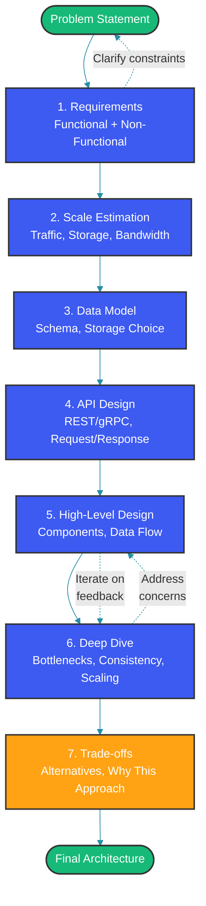

# System Design Interview Framework

## Overview

System design interviews evaluate your ability to architect large-scale distributed systems. Unlike coding interviews, there is no single correct answer. This framework provides a structured approach: gather requirements, estimate scale, design data models, define APIs, build high-level architecture, dive deep into components, and discuss trade-offs.

## Step-by-Step Framework



## Step 1: Requirements Gathering

```java
// Functional Requirements Checklist
public class RequirementsGathering {
    
    public Requirements collect() {
        return Requirements.builder()
            // Core features
            .createItem(true)        // User creates content
            .readItem(true)          // User reads/fetches content
            .updateItem(false)       // User edits content
            .deleteItem(true)        // User deletes content
            .searchItems(true)       // Search across content
            .shareItems(false)       // Share between users
            
            // Non-functional requirements
            .dailyActiveUsers("100M")
            .readWriteRatio("100:1") // Read-heavy
            .latencyRequirement("< 200ms p95")
            .availabilityTarget("99.99%")
            .durability("No data loss")
            .consistencyModel("Eventual")
            .build();
    }
}
```

### Example: Requirements for a URL Shortener

| Requirement | Detail |
|---|---|
| Create short URL | Long → short (6-7 chars) |
| Redirect | Short → long (302 redirect) |
| Analytics | Track click counts, referrers |
| Scale | 100M URLs created/month, 1B redirects/month |
| Latency | Redirect < 10ms |
| Consistency | Strong for creation, eventual for analytics |

## Step 2: Scale Estimation

```java
public class ScaleEstimator {
    
    public ScaleEstimate estimate(int dailyActiveUsers, int requestsPerUser, 
            int dataSizePerItem, int itemsPerUser) {
        
        long dailyRequests = (long) dailyActiveUsers * requestsPerUser;
        double queriesPerSecond = dailyRequests / 86400.0;
        double peakQPS = queriesPerSecond * 2.0; // 2x peak factor
        
        long dailyStorage = (long) dailyActiveUsers * itemsPerUser * dataSizePerItem;
        long monthlyStorage = dailyStorage * 30L;
        long yearlyStorage = dailyStorage * 365L;
        
        // Bandwidth estimation
        long dailyIngress = dailyRequests * 100;  // 100 bytes avg request
        long dailyEgress = dailyRequests * 5000;  // 5KB avg response
        
        return ScaleEstimate.builder()
            .dailyActiveUsers(dailyActiveUsers)
            .queriesPerSecond((int) queriesPerSecond)
            .peakQPS((int) peakQPS)
            .dailyStorageGb(dailyStorage / (1024 * 1024 * 1024))
            .monthlyStorageTb(monthlyStorage / (1024L * 1024 * 1024 * 1024))
            .dailyBandwidthGb((dailyIngress + dailyEgress) / (1024 * 1024 * 1024))
            .build();
    }
}
```

### Estimation Cheat Sheet

| Item | Decimal | ~2^X |
|---|---|---|
| 1 million | 10^6 | ~2^20 |
| 10 million | 10^7 | ~2^23 |
| 100 million | 10^8 | ~2^27 |
| 1 billion | 10^9 | ~2^30 |
| 1 trillion | 10^12 | ~2^40 |

## Step 3: Data Model Design

```java
public class DataModelDesign {
    
    // Example: URL Shortener data model
    @Entity
    @Table(name = "url_mappings")
    public class UrlMapping {
        @Id
        private String shortKey;       // Base62 encoded (6-7 chars)
        
        @Column(length = 2048, nullable = false)
        private String longUrl;
        
        @Column(nullable = false)
        private String userId;
        
        @Column(nullable = false)
        private Instant createdAt;
        
        @Column
        private Instant expiresAt;
        
        @Version
        private Long version;          // Optimistic locking
    }
    
    // Example: Social graph data model
    @Entity
    @Table(name = "follows",
           uniqueConstraints = @UniqueConstraint(columnNames = {"follower", "followee"}))
    public class Follow {
        @Id
        private Long id;
        
        @Column(nullable = false)
        private String follower;
        
        @Column(nullable = false)
        private String followee;
        
        @Column(nullable = false)
        private Instant createdAt;
    }
}
```

### Storage Selection Decision Tree

| Requirement | Storage Choice |
|---|---|
| Relational, ACID transactions | PostgreSQL, MySQL |
| Key-value, low latency | Redis, Memcached |
| Document, flexible schema | MongoDB, DynamoDB |
| Time series, metrics | InfluxDB, TimescaleDB |
| Full-text search | Elasticsearch |
| Blob storage, media | S3, GCS |
| Graph relationships | Neo4j, JanusGraph |
| Message queue | Kafka, RabbitMQ |

## Step 4: API Design

```java
@RestController
@RequestMapping("/api/v1")
public class ApiDesignController {
    
    // RESTful API design principles
    
    // Create: POST
    @PostMapping("/urls")
    public ResponseEntity<ShortUrlResponse> createShortUrl(
            @Valid @RequestBody CreateUrlRequest request) {
        // Request: { "longUrl": "https://example.com/very-long-path", 
        //             "customAlias": "optional", "ttlSeconds": 86400 }
        // Response: { "shortUrl": "https://short.est/abc123", 
        //             "expiresAt": "2026-05-15T00:00:00Z" }
        return ResponseEntity.status(201).body(urlService.create(request));
    }
    
    // Read: GET
    @GetMapping("/urls/{shortKey}")
    public ResponseEntity<UrlDetails> getUrlDetails(@PathVariable String shortKey) {
        // Response: { "shortKey": "abc123", "longUrl": "https://...",
        //             "createdAt": "...", "clickCount": 1500 }
        return ResponseEntity.ok(urlService.getDetails(shortKey));
    }
    
    // Update: PUT/PATCH
    @PatchMapping("/urls/{shortKey}")
    public ResponseEntity<UrlDetails> updateUrl(
            @PathVariable String shortKey,
            @RequestBody UpdateUrlRequest request) {
        return ResponseEntity.ok(urlService.update(shortKey, request));
    }
    
    // Delete: DELETE
    @DeleteMapping("/urls/{shortKey}")
    public ResponseEntity<Void> deleteUrl(@PathVariable String shortKey) {
        urlService.delete(shortKey);
        return ResponseEntity.noContent().build();
    }
    
    // Pagination with cursor
    @GetMapping("/urls")
    public ResponseEntity<PageResponse<UrlDetails>> listUrls(
            @RequestParam(required = false) String cursor,
            @RequestParam(defaultValue = "20") int limit) {
        // Cursor-based pagination is more scalable than offset
        return ResponseEntity.ok(urlService.list(cursor, limit));
    }
}
```

## Step 5: High-Level Design

### Key Components

```java
@Service
public class HighLevelDesign {
    
    // Every system design should identify:
    
    // 1. Load Balancer: Distribute traffic across servers
    //    Options: NGINX, HAProxy, AWS ALB, Cloudflare
    
    // 2. API Gateway: Authentication, rate limiting, routing
    //    Options: Kong, Zuul, Spring Cloud Gateway
    
    // 3. Application Servers: Stateless, horizontally scalable
    //    Configuration: Auto-scaling group, container orchestration
    
    // 4. Cache Layer: Reduce database load, improve latency
    //    Multi-tier: Local (Caffeine) + Distributed (Redis/Memcached)
    
    // 5. Database: Primary data storage
    //    Pattern: Read replicas, sharding, replication
    
    // 6. Message Queue: Async processing, decoupling
    //    Uses: Notifications, analytics, background jobs
    
    // 7. CDN: Static content delivery
    //    Uses: Images, videos, static assets
    
    public ArchitectureDiagram build() {
        return ArchitectureDiagram.builder()
            .component("Client", "Mobile/web app", 1)
            .component("CDN", "CloudFront/Cloudflare", 2)
            .component("LB", "Load balancer", 2)  // Multi-AZ
            .component("API", "API Gateway", 4)
            .component("Service", "Application servers", 20)
            .component("Cache", "Redis cluster", 10)
            .component("DB", "Database (read replicas)", "1 primary + 5 replicas")
            .component("Queue", "Kafka/RabbitMQ", 3)
            .component("Worker", "Background workers", 10)
            .build();
    }
}
```

## Step 6: Deep Dive

### Common Deep Dive Topics

```java
@Component
public class DeepDiveTopics {
    
    // 1. Database Sharding
    public ShardingStrategy designSharding(String shardKey) {
        return ShardingStrategy.builder()
            .algorithm("consistent-hashing")  // vs range, hash mod
            .shardKey(shardKey)                // user_id, url_hash
            .numberOfShards(256)               // Pre-allocate, support growth
            .rebalanceStrategy("virtual-nodes")
            .build();
    }
    
    // 2. Caching Strategy
    public CacheStrategy designCaching() {
        return CacheStrategy.builder()
            .pattern("cache-aside")          // vs write-through, write-behind
            .eviction("LRU")                  // LFU for popularity, TTL for freshness
            .ttl(Map.of(
                "user-profile", "1 hour",
                "timeline", "5 minutes",
                "trending", "2 minutes"
            ))
            .build();
    }
    
    // 3. Consistency Model
    public ConsistencyApproach handleConsistency() {
        return ConsistencyApproach.builder()
            .strongConsistency("User creation, URL redirect mapping")
            .eventualConsistency("Timeline, feed, analytics")
            .causalConsistency("Comments, replies (happens-before order)")
            .build();
    }
    
    // 4. Fault Tolerance
    public FaultTolerance designResilience() {
        return FaultTolerance.builder()
            .circuitBreaker("Resilience4j, Hystrix")
            .retryPolicy("Exponential backoff with jitter, max 3 retries")
            .bulkhead("Thread pool isolation per service")
            .healthCheck("Readiness + liveness probes")
            .build();
    }
}
```

## Step 7: Trade-offs Discussion

```java
public class TradeOffAnalysis {
    
    // Every design decision involves trade-offs
    
    public void discussTradeOffs() {
        // Monolith vs Microservices
        Tradeoff monolithVsMicro = Tradeoff.builder()
            .optionA("Monolith")
            .proA("Simple, fast development, easy transactions")
            .conA("Scaling challenges, deployment coupling")
            .optionB("Microservices")
            .proB("Independent scaling, team autonomy")
            .conB("Network overhead, eventual consistency, complexity")
            .build();
        
        // SQL vs NoSQL
        Tradeoff sqlVsNosql = Tradeoff.builder()
            .optionA("PostgreSQL")
            .proA("ACID, joins, mature ecosystem")
            .conA("Vertical scaling ceiling, schema rigidity")
            .optionB("Cassandra")
            .proB("Horizontal scaling, high write throughput")
            .conB("No joins, eventual consistency, complex data modeling")
            .build();
        
        // Synchronous vs Async Processing
        Tradeoff syncVsAsync = Tradeoff.builder()
            .optionA("Synchronous")
            .proA("Simple, consistent, real-time")
            .conA("Tight coupling, cascading failures")
            .optionB("Async (Queue)")
            .proB("Decoupled, resilient, buffer for spikes")
            .conB("Higher latency, eventual consistency, debugging complexity")
            .build();
    }
}
```

## Scoring Criteria Rubric

| Criteria | Excellent | Good | Needs Work |
|---|---|---|---|
| Requirements | Clarifies ambiguous, prioritizes | Covers main points | Misses key requirements |
| Estimation | Reasonable numbers with justification | Ballpark numbers | No estimation |
| Data Model | Appropriate storage, schema shown | Mentions database type | Wrong storage choice |
| API Design | Clean REST/gRPC with error handling | Basic endpoints | No API discussion |
| Architecture | Clear diagram with data flow | Shows components | Missing components |
| Deep Dive | Addresses bottlenecks, scaling | One area explored | Surface level only |
| Trade-offs | Compares alternatives, justifies | Mentions pros/cons | No trade-off discussion |

## Best Practices

- Start with the simplest design and add complexity only when justified by scale requirements
- Communicate your thought process continuously; treat the interview as a collaborative discussion
- Use back-of-the-envelope calculations with round numbers (millions, billions) for estimation
- Draw a clear, well-labeled architecture diagram showing data flow between components
- Always discuss failure scenarios: what happens when a service, cache, or database goes down?
- Prioritize features: discuss what you'd build for MVP vs v2 vs v3
- Know the limitations of your design: be explicit about what assumptions you're making

## Common Mistakes

- Jumping to a specific technology (Kafka, Redis) before understanding the requirements and scale
- Designing for excessive scale (100 billion users) when the problem states 10 million DAU
- Ignoring non-functional requirements like latency, consistency, and availability
- Proposing a single database solution (e.g., one MySQL instance) for Twitter-scale problems
- Not discussing read vs write trade-offs, especially when your design heavily favors one over the other
- Forgetting to mention monitoring, alerting, deployment, and CI/CD as part of the operational picture
- Treating the interview as a quiz with a single correct answer rather than an exploration of trade-offs

## Summary

The system design interview evaluates your ability to think at scale while balancing competing concerns. Follow the seven-step framework: Requirements → Estimation → Data Model → API Design → High-Level Design → Deep Dive → Trade-offs. The best candidates communicate clearly, make reasonable assumptions, discuss trade-offs explicitly, and design systems that are appropriately complex for the stated requirements. Practice with diverse problems: URL shortener, chat system, news feed, video streaming, and ride-sharing.

## References

- [Designing Data-Intensive Applications (Martin Kleppmann)](https://dataintensive.net/)
- [Grokking the System Design Interview](https://www.designgurus.org/course/grokking-system-design-interview)
- [System Design Primer](https://github.com/donnemartin/system-design-primer)
- [ByteByteGo System Design](https://bytebytego.com/)
- [Alex Xu: System Design Interview Vol 1 & 2](https://www.amazon.com/System-Design-Interview-Insiders-Guide/dp/1736049119)
